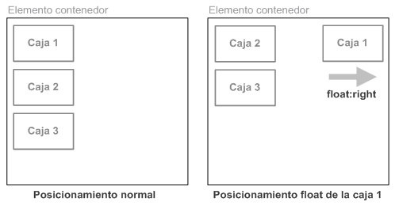

# Diseño CSS

Hasta el momneto hemos visto los fundamentos básicos de CSS: cómo dar estilo al texto, cómo manipular las cajas que incluyen tu contenido, etc. Ahora vamos a explorar cómo colocar tus cajas en el lugar que elijas con respecto a la ventana principal y el resto de cajas.

En CSS existen diferentes técnicas básicas de maquetación que veremos a continuación

## Normal flow

Los elementos en las páginas web se presentan de acuerdo con el flujo normal, hasta que hacemos algo que cambie eso.

En primer lugar, se toma de las cajas de cada uno de los elementos el contenido, luego se añade cualquier área de relleno, borde y margen alrededor de ellas; es el modelo de cajas que hemos visto antes.

De manera predeterminada, el contenido de un elemento de nivel de bloque es el 100% del ancho de su elemento padre y su altura viene determinada por su contenido. Los elementos en línea tienen su altura y anchura determinados por su contenido.

## Posicionamiento

El posicionamiento permite sacar elementos del flujo normal del diseño del documento, y hacer que se comporten de manera distinta, por ejemplo sentarse encima de otro o permanecer en el mismo lugar dentro de la ventana navegador. Veremos los diferentes valores **position**, y como usarlos.

* **Posicionamiento normal o estático** (*position: static;*): se trata del posicionamiento que utilizan los navegadores si no se indica lo contrario.
* **Posicionamiento relativo** (*position: relative;*): variante del posicionamiento normal que consiste en posicionar una caja según el posicionamiento normal y después desplazarla respecto de su posición original.

    

* **Posicionamiento absoluto** (*position: absolute;*): la posición de una caja se establece de forma absoluta respecto de su elemento contenedor y el resto de elementos de la página ignoran la nueva posición del elemento.

    

* **Posicionamiento fijo** (*position: fixed;*): variante del posicionamiento absoluto que convierte una caja en un elemento inamovible, de forma que su posición en la pantalla siempre es la misma independientemente del resto de elementos e independientemente de si el usuario sube o baja la página en la ventana del navegador.

La propiedad position sólo indica cómo se posiciona una caja, pero no la desplaza.

Normalmente, cuando se posiciona una caja también es necesario desplazarla respecto de su posición original o respecto de otro origen de coordenadas. CSS define cuatro propiedades llamadas *top*, *right*, *bottom* y *left* para controlar el desplazamiento de las cajas posicionadas.

## Floats

La propiedad **float** fue introducida para permitir a los desarrolladores implementar diseños sencillos que incluyeran una imagen flotando dentro de una columna de texto, con el texto envolviendo la parte izquierda o derecha de la imagen. El tipo de cosa que encuentras habitualmente en el diseño de un periódico. [^1]

Pero los desarrolladores web pronto se dieron cuenta de que podían flotar cualquier cosa, no solo imágenes, por lo que su uso se extendió.

Los elementos flotantes han sido usados comúnmente para crear diseños web completos con múltiples columnas situadas unas al lado de las otras (el comportamiento por defecto sería que las columnas se situaran unas debajo de las otras, en el mismo orden en el que aparecen en el código fuente). Ahora hay disponibles técnicas más modernas y mejores, que exploraremos más adelante en este módulo, por lo que el uso de float de este modo debería contemplarse como una técnica anticuada.

La siguiente imagen muestra el resultado de posicionar de forma flotante hacia la derecha la caja 1: **float: right;**



La siguiente imagen muestra el resultado de posicionar de forma flotante hacia la izquierda la caja 1: **float: left;**. Vemos que la caja 1 tapa a la caja 2.


La siguiente imagen muestra el resultado de posicionar de forma flotante hacia la izquierda todas las cajas: **float: left;**


## Flexbox

**Flexbox** es un método de diseño de página unidimensional para compaginar elementos en filas o columnas. Los elementos de contenido se ensanchan para rellenar el espacio adicional y se encogen para caber en espacios más pequeños.

Durante mucho tiempo, las únicas herramientas fiables con compatibilidad cruzada entre navegadores disponibles para crear diseños CSS fueron cosas como la flotación y el posicionamiento. Están bien y funcionan, pero de alguna manera también limitan bastante y frustran.

Con tales herramientas resulta difícil, si no imposible, lograr obtener en cualquier forma conveniente y flexible un diseño de página sencillo con unos requisitos como los siguientes:

* Centrar verticalmente un bloque de contenido dentro de su elemento padre.
* Hacer que todos los elementos secundarios de un contenedor ocupen una cantidad igual del ancho/alto disponible, independientemente del ancho/alto que haya disponible.
* Hacer que todas las columnas en una compaginación en columnas múltiples adopten la misma altura incluso si contienen cantidades diferentes de contenido.

Para seleccionar qué elementos se van a presentar como cajas flexibles establecemos un valor especial de *display* en el elemento padre de los elementos que deseas editar.

Ejemplo

``` css
section {
    display: flex;
}
```

Esto hace que el elemento `<section>` se convierta en contenedor flex, y sus hijos en elementos flexibles.

Para ver más detalles del modelo Flexbox pueden visitar https://developer.mozilla.org/es/docs/Learn/CSS/CSS_layout/Flexbox y https://css-tricks.com/snippets/css/a-guide-to-flexbox/

## Grids

La compaginación en cuadrícula con CSS es un método de diseño de páginas web en dos dimensiones. Te permite distribuir el contenido en filas y columnas, y tiene muchas características que facilitan la creación de diseños complejos.

Una cuadrícula es un conjunto de líneas horizontales y verticales que crean un patrón sobre el que podemos alinear nuestros elementos de diseño. Las cuadrículas nos ayudan a crear diseños de página en que los elementos no saltan ni cambian de ancho cuando nos movemos de una página a otra, y así proporcionan a nuestras páginas web un aspecto más coherente.

Una cuadrícula en general tiene columnas, filas y luego espacios entre cada fila y cada columna, conocidos comúnmente como canales.

Para definir una cuadrícula utilizamos el valor **grid** de la propiedad *display*. Al igual que con el método Flexbox, esto activa la compaginación de cuadrícula y todos los elementos que son hijos directos del contenedor se convierten en elementos de cuadrícula.

A diferencia del método Flexbox, los elementos no se ven diferentes inmediatamente. La declaración **display: grid;** te proporciona una cuadrícula de una sola columna, por lo que tus elementos continúan mostrándose uno debajo del otro, como lo hacen en el flujo normal.

Para ver algo que se parezca más a una cuadrícula, necesitamos añadir columnas a la cuadrícula. Para ello usamos el **grid-template-columns**

``` css
.container {
    display: grid;
    grid-template-columns: 200px 200px 200px;
}
```

Para ver más detalle del modelo de Grid visitar https://developer.mozilla.org/es/docs/Learn/CSS/CSS_layout/Grids y https://css-tricks.com/snippets/css/complete-guide-grid/

## Maquetar nuestra calculadora usando flexbox

1. Modificar el archivo **estilo.css** para agregar el modelo de flexbox

    ``` css hl_lines="13 14 15 16 17 18 19 20 21 22 23"
    :root {
        --light-blue: #8ecae6ff;
        --blue-green: #219ebcff;
        --prussian-blue: #023047ff;
        --honey-yellow: #ffb703ff;
        --orange: #fb8500ff;
    }

    html {
        font-family: "Roboto", sans-serif;
    }

    html, body {
        height: 100%;
        width: 100%;
        padding: 0;
        margin: 0;
    }

    body {
        display: flex;
        flex-direction: column;
    }

    header {
        background-color: var(--light-blue);
    }

    header > h1 {
        color: var(--prussian-blue);
    }

    footer {
        color: var(--blue-green);
    }

    #origen, #destino {
        color: var(--orange);
    }

    aside {
        border-left: 2px solid var(--prussian-blue);
    }

    aside > ul > li {
        color: var(--honey-yellow);
    }

    .btn-tranformar {
        background-color: var(--orange);
        color: var(--prussian-blue);
    }
    ```

2. Modificar el estilo del elemento header para que el titulo aparezca junto a la imagen

    ``` css hl_lines="26"
    :root {
        --light-blue: #8ecae6ff;
        --blue-green: #219ebcff;
        --prussian-blue: #023047ff;
        --honey-yellow: #ffb703ff;
        --orange: #fb8500ff;
    }

    html {
        font-family: "Roboto", sans-serif;
    }

    html, body {
        height: 100%;
        width: 100%;
        padding: 0;
        margin: 0;
    }

    body {
        display: flex;
        flex-direction: column;
    }

    header {
        display: flex;
        background-color: var(--light-blue);
    }

    header > h1 {
        color: var(--prussian-blue);
    }

    footer {
        color: var(--blue-green);
    }

    #origen, #destino {
        color: var(--orange);
    }

    aside {
        border-left: 2px solid var(--prussian-blue);
    }

    aside > ul > li {
        color: var(--honey-yellow);
    }

    .btn-tranformar {
        background-color: var(--orange);
        color: var(--prussian-blue);
    }
    ```

3. Agregar el estilo al elemento main

    ``` css hl_lines="38 39 40 41 42 43 44 45"
    :root {
        --light-blue: #8ecae6ff;
        --blue-green: #219ebcff;
        --prussian-blue: #023047ff;
        --honey-yellow: #ffb703ff;
        --orange: #fb8500ff;
    }

    html {
        font-family: "Roboto", sans-serif;
    }

    html, body {
        height: 100%;
        width: 100%;
        padding: 0;
        margin: 0;
    }

    body {
        display: flex;
        flex-direction: column;
    }

    header {
        display: flex;
        background-color: var(--light-blue);
    }

    header > h1 {
        color: var(--prussian-blue);
    }

    footer {
        color: var(--blue-green);
    }

    main {
        display: flex;
        flex: auto;
    }

    main > div {
        flex: auto;
    }

    #origen, #destino {
        color: var(--orange);
    }

    aside {
        border-left: 2px solid var(--prussian-blue);
    }

    aside > ul > li {
        color: var(--honey-yellow);
    }

    .btn-tranformar {
        background-color: var(--orange);
        color: var(--prussian-blue);
    }
    ```

4. Modificar el elemento aside para que aparezca junto al main

    ``` css hl_lines="52 53"
    :root {
        --light-blue: #8ecae6ff;
        --blue-green: #219ebcff;
        --prussian-blue: #023047ff;
        --honey-yellow: #ffb703ff;
        --orange: #fb8500ff;
    }

    html {
        font-family: "Roboto", sans-serif;
    }

    html, body {
        height: 100%;
        width: 100%;
        padding: 0;
        margin: 0;
    }

    body {
        display: flex;
        flex-direction: column;
    }

    header {
        display: flex;
        background-color: var(--light-blue);
    }

    header > h1 {
        color: var(--prussian-blue);
    }

    footer {
        color: var(--blue-green);
    }

    main {
        display: flex;
        flex: auto;
    }

    main > div {
        flex: auto;
    }

    #origen, #destino {
        color: var(--orange);
    }

    aside {
        min-width: 150px;
        flex: 1;
        border-left: 2px solid var(--prussian-blue);
    }

    aside > ul > li {
        color: var(--honey-yellow);
    }

    .btn-tranformar {
        background-color: var(--orange);
        color: var(--prussian-blue);
    }
    ```
5. Guardar y recargar la página para ver los cambios.

!!! question "Ejercicio 3 pt"
    1. Agregar un class al botón *Enviar resultado* creado en el ejercicio anterior y dar estilo al botón. **0.5 pt**.
    2. Centrar horizontalmente el texto del elemento footer **0.5 pt**.
    3. Eliminar el subrayado de los enlaces del listado de definiciciones de los diferentes EPSG **0.5 pt**.
    4. Modificar el estilo del elemento header para que el texto del titulo quede alineado verticalmente en el centro de su contenedor **0.5 pt**. Ayuda usar la propiedad *align-items*
    5. Modificar el estlio del elemento header para que la imagen y el titulo queden distribuidos de igual forma detro de su contenedor **0.5 pt**. Ayuda usar la propiedad *justify-content*
    6. Modificar el estilo de la tabla para que los elementos se vean más ordenados dentro de la página. Algunas ideas: centrar la tabla, dar mas espacio entre los elementos, agregar un estilo de borde para separar los elementos de la columna de origen de los de la columna de destino, etc. **0.5 pt**.

## Referencias

[^1]: https://developer.mozilla.org/es/docs/Learn/CSS/CSS_layout