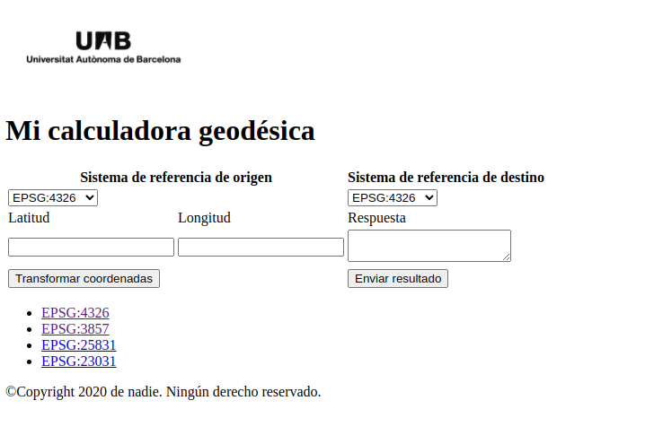

# Elementos HTML

## head

El elemento HTML **`<head>`** provee información general (metadatos) acerca del documento, incluyendo su título y enlaces a scripts y hojas de estilos. [^1]

Es la **cabecera** y actua como contenedor para todos los parámetros que quieras incluir en el documento HTML que no serán visibles a los visitantes de la página. Incluye cosas como palabras clave y la descripción de la página que quieras mostrar en los resultados de búsqueda, así como la hoja de estilo para formatear nuestro contenido, declaraciones de codificación de caracteres y más.

Algunos elementos que deberían estar presentes en la cabecera 

### title

El elemento **`<title>`** se usa para poner el título a la página. Es lo que aparece en la barra del navegador

### metadatos

Los metadatos son los datos que describen la página. HTML tiene una forma "oficial" para introducir metadatos y para ello se usa el elemento **`<meta>`**. Hay muchos tipos diferentes de `<meta>` que se pueden incluir en el `<head>` de una página.

A continuación veremos algunos de los `<meta>` más usados

#### Codificación de caracteres

Especifica especifica la codificación de caracteres del documento, esto quiere decir el conjuto de carácteres que se pueden usar en la página. Esto es muy útil e importante para representar correctamente caracteres especiales como los acentos u caracteres de otros idioma. Por ejemplo japonés 

Ejemplo

``` html
<meta charset="utf-8">
```

#### Autor

Especificar un autor resulta ventajoso por diversos motivos: es útil saber quién escribió la página para poder ponerte en contacto con el autor si tienes preguntas sobre el contenido. Algunos sistemas de gestión de contenido tienen herramientas para extraer automáticamente la información del autor de la página y ponerla a disposición para tales fines. [^2]

Ejemplo

``` html
<meta name="author" content="Pepe Perez">
```

#### Descripción

Especificar una descripción que incluya palabras clave relacionadas con el contenido de tu página resulta útil porque tiene el potencial de hacer que la página aparezca más arriba en las búsquedas relevantes que efectúan los motores de búsqueda. Mejora el SEO

**SEO** (Search Engine Optimization) también conocido como posicionamiento web, es el proceso de hacer un sitio web más visible en los resultados de búsqueda o mejorar el ranking de búsqueda.

Ejemplo

``` html
<meta name="description" content="El área de aprendizaje de MDN pretende
proporcionar a los recién llegados a la web todo lo que deben
saber para empezar a desarrollar páginas web y aplicaciones web.">
```

#### Viewport

El viewport del navegador es el área de la ventana en donde el contenido web está visible. Generalmente no es del mismo tamaño que la página renderizada, en donde se brindan barras de desplazamiento para que el usuario pueda acceder a todo el contenido.

Dispositivos con pantallas angostas (p.e. móviles) muestran la página en una ventana virtual o viewport, que es usualmente más ancho que la pantalla y la comprimen de manera que pueda verse completa. El usuario podrá recorrerla y hacer zoom para ver diferentes áreas de la página. Por ejemplo, si una pantalla móvil tiene un ancho 640px, las páginas pueden ser procesadas con un viewport de 980px, y después comprimidas para que entren en 640px.

Esto se hace porque muchas páginas no están optimizadas para dispositivos móviles y se quiebran (o, al menos, se ven mal) cuando son procesadas a un ancho de viewport pequeño. El viewport virtual es una forma de resolver el problema de sitios no optimizados para móviles, logrando que se vean mejor. [^3]

El uso del viewport fácilita el diseño *responsive* de las páginas. 

La propiedad **width** controla el tamaño del viewport. Puede definirse con un número en pixeles como *width=600* o con un valor especial **device-width** que es el equivalente al ancho de la pantalla en píxeles CSS en una escala de 100%. 

La propiedad **initial-scale** controla el nivel de zoom cuando la página se carga por primera vez.

Ejemplo

``` html
<meta name="viewport" content="width=device-width, initial-scale=1.0">
```

#### Redes sociales

[Open Graph Data](https://ogp.me/) es un protocolo de metadatos que Facebook inventó para proveer metadatos más ricos para los sitios web. Un efecto de esto es que cuando desde Facebook enlazas a una paágina, el enlace aparece con una imagen y una descripción, lo que resulta en una experiencia más enriquecedora para los usuarios.

Ejemplo

``` html
<meta property="og:image" content="https://developer.cdn.mozilla.net/static/img/opengraph-logo.dc4e08e2f6af.png">
<meta property="og:description" content="The Mozilla Developer Network (MDN) proporciona información
sobre tecnologías Open Web, incluidas HTML, CSS y APIs para ambos sitios web
y aplicaciones HTML5. También documenta productos Mozilla, como el sistema operativo Firefox.">
<meta property="og:title" content="Mozilla Developer Network">
```

Twitter también tiene sus metadatos propios, las [Twitter Cards](https://developer.twitter.com/en/docs/twitter-for-websites/cards/overview/abouts-cards), que tienen un efecto similar cuando la URL del sitio se muestra en twitter.com.

Ejemplo

``` html
<meta name="twitter:title" content="Mozilla Developer Network">
```

### favicon

Para enriquecer un poco más el diseño de tu sitio puedes añadir en tus metadatos referencias a iconos personalizados, que se mostrarán en determinados contextos. El más común de ellos es el **favicon** (abreviatura de *favorite icon* —icono favorito, referido al uso que se le da en las listas de favoritos o de marcadores (bookmarks).

El humilde favicon ha existido durante muchos años. Es el primer icono de este tipo: un icono cuadrado de 16 píxeles que se utiliza en varios lugares. Es posible que veas (según el navegador) favicons que se muestran en la pestaña del navegador que contiene cada página abierta y junto a las páginas marcadas en el panel de marcadores.

Ejemplo

``` html
<link rel="shortcut icon" href="favicon.ico" type="image/x-icon">
```

### Carga de CSS y JavaScript

Prácticamente todos los sitios web usan CSS para darles un buen aspecto y JavaScript para añadir funcionalidades interactivas, como reproductores de vídeo, mapas, juegos y demás. La manera más habitual de añadir CSS y JavaScript a una página web es con los elementos `<link>` y el elemento `<script>`, respectivamente.

El elemento `<link>` siempre debe ir dentro del `<head>` de tu documento. Este toma dos atributos, rel="stylesheet", que indica que es la hoja de estilo del documento, y href, que contiene la ruta al archivo de la hoja de estilo.

Ejemplo

``` html
<link rel="stylesheet" href="my-css-file.css">
```

El elemento `<script>` también debería ir en el head, y debería incluir un atributo *src* con la ruta al JavaScript que quieres cargar, y *defer*, que básicamente le dice al navegador que cargue el JavaScript al mismo tiempo que el HTML de la página. Esto es útil porque hace que todo el HTML se cargue antes de ejecutar el JavaScript, para que no haya errores porque el JavaScript ha intentado acceder a un elemento HTML que todavía no existe. De hecho hay múltiples formas de gestionar la carga del JavaScript en una página por ejemplo poner el elemento `<script>` al final del body.

Ejemplo

``` html
<script src="my-js-file.js" defer></script>
```

## Elementos de "estructura", "contenedores" o "envolturas"

Si bien la mayoría de los elementos del html se pueden anidar, exisiten algunos elementos que se usan para estructurar las distintas áereas de la página. Existen alungunos elementos que tienen un significado semántico basado en su funcionalidad como por ejemplo `<footer>` que presentan sin ambigüedad los diferentes contenidos y otros elementos no-semánticos que tienen un uso generalista como por ejemplo `<div>`  

### Elementos semánticos

El contenído semántico permite que las tecnologías de accesibilidad y los lectores de pantalla puedan reconocer esos elementos y asistir en tareas como *encontrar el menú de navegación*, o *encontrar el contenido principal*. 

#### body

El elemento `<body>` contiene todo el contenido que se quiere mostrar en la página y por lo tanto sólo puede haber uno en cada página.

#### header

El elemento `<header>` representa un contenido introductorio del contenedor en el que se aloja. Si este es *hijo* de un elemento `<body>`, se convertirá en el encabezado principal del sitio web, pero si es hijo de un elemento `<article>` o un elemento `<section>`, entonces simplemente será el encabezado particular de cada sección.

Al igual que ocurre con el *footer*, se suelen utilizar únicamente como la cabecera y pie de una página (*body*) pero no se les da un uso habitual y debido en los *article* o *section*.

!!! warning
    No confundir con el elemento `<head>` ni con títulos y encabezados

#### footer 

El elemento `<footer>` representa el contenido al pie de su elemento superior. Generalmente se usa como pie de página. 

En general el footer incluye información del autor, enlaces a documentos relacionados, contacto, copyright y similares.

#### nav

El elemento `<nav>` o menú de navegación contiene la funcionalidad de navegación principal de la página. Contiene enlaces a otras páginas o zonas de la página. 

Hay que tener en cuenta que no debería ser un listado de elementos, sino una zona de navegación. Esto significa que no todos los enlaces de una página han de encontrarse dentro de este elemento.

#### main

El elemento `<main>` representa el contenido principal de la página. Utilizaremos `<main>` solamente una vez para cada página y lo situaremos directamente dentro del elemento `<body>`. Es mejor que no lo anidemos en otros elementos.

Dentro del *main* encontraremos varias subsecciones (además de la barra lateral `<aside>`) representadas por los elementos `<article>`, `<section>`, y `<div>`.

#### aside

El elemento `<aside>` o barra lateral incluye contenido que no está directamente relacionado con el contenido principal, pero que puede aportar información adicional relacionada indirectamente con él (resúmenes, enlaces relacionados, etc.). A menudo se coloca dentro de `<main>`

### Elementos no semánticos

#### div

El elemento `<div>` es un elemento de bloque y que se utiliza cuando no se tenemos un elementos semántico en el que indicar el contenido o en el caso de que no se quiera dar ningún significado concreto. Es él elemento **comodín** por exelencia.

#### span

El elemento `<span>` es un elemento de linea (que se utiliza en el interior de una línea) y que al igual que el **div* se utiliza cuando no se tenemos un elementos semántico en el que indicar el contenido o en el caso de que no se quiera dar ningún significado específico.

Se usa frecuentemente para dar estilo a un texto dentro de una línea. Por ejemplo

``` html
<p>Tengo un perro <span style="color:green">verde</span> que tiene los ojos <span style="color:blue">azules</span></p> 
```
<p>Tengo un perro <span style="color:green">verde</span> que tiene los ojos <span style="color:blue">azules</span></p> 

### Dar estructura a nuestra página

En el cápitulo anterior crearmos una página web sencilla con la estructura mínima donde solo aparecía el texto "Mi calculadora geodésica". Modificaremos la página y le daremos una mejor estructura.

####  Ejercicios entregables

!!! question "Calculadora geodésica"

    1. Abrir en el editor de texto el archivo **index.html** que se encuentra en la carpeta *web-mgeo*

    2. Agregar el autor y la descripción en el **head**. Para ello escribir lo siguiente

        ``` html hl_lines="5 6"
        <!DOCTYPE html>
        <html lang="es">
        <head>
            <meta charset="UTF-8">
            <meta name="author" content="[VUESTRO NOMBRE]">
            <meta name="description" content="Calculadora geodésica que permite hacer la transformación de coordenadas geográficas en linea">
            <title>Mi calculadora geodésica</title>
        </head>
        <body>
            
            <h1>Mi calculadora geodésica</h1>
        </body>
        </html>
        ```

    3. Agregar el viewport para que la página sea "*responsive*". 

        ``` html hl_lines="7"
        <!DOCTYPE html>
        <html lang="es">
        <head>
            <meta charset="UTF-8">
            <meta name="author" content="[VUESTRO NOMBRE]">
            <meta name="description" content="Calculadora geodésica que permite hacer la transformación de coordenadas geográficas en linea">
            <meta name="viewport" content="width=device-width, initial-scale=1.0">
            <title>Mi calculadora geodésica</title>
        </head>
        <body>
            
            <h1>Mi calculadora geodésica</h1>
        </body>
        </html>
        ```

    4. Agregar el favicon de la página

        ``` html hl_lines="8"
        <!DOCTYPE html>
        <html lang="es">
        <head>
            <meta charset="UTF-8">
            <meta name="author" content="[VUESTRO NOMBRE]">
            <meta name="description" content="Calculadora geodésica que permite hacer la transformación de coordenadas geográficas en linea">
            <meta name="viewport" content="width=device-width, initial-scale=1.0">
            <link href="https://www.icgc.cat/bundles/microblauicgc/img/favicon.ico" rel="shortcut icon" type="image/x-icon">
            <title>Mi calculadora geodésica</title>
        </head>
        <body>
            
            <h1>Mi calculadora geodésica</h1>
        </body>
        </html>
        ```

    5. Guardar y recargar la página, veremos que aprece nuestro favicon en la pestaña del navegador pero que el resto de nuestra página sigue igual. Esto es debido a que como ya hemos mencionado los metadatos de la página no son visibles.

    6. Agregar el header y footer a la pagina. Para ello escribimos lo siguiente en nuestro archivo *index.html*

        ``` html hl_lines="12-16"
        <!DOCTYPE html>
        <html lang="es">
        <head>
            <meta charset="UTF-8">
            <meta name="author" content="[VUESTRO NOMBRE]">
            <meta name="description" content="Calculadora geodésica que permite hacer la transformación de coordenadas geográficas en linea">
            <meta name="viewport" content="width=device-width, initial-scale=1.0">
            <link href="https://www.icgc.cat/bundles/microblauicgc/img/favicon.ico" rel="shortcut icon" type="image/x-icon">
            <title>Mi calculadora geodésica</title>
        </head>
        <body>
            <header>
                
                <h1>Mi calculadora geodésica</h1>
            </header>
            <footer>©Copyright 2020 de nadie. Ningún derecho reservado.</footer>
        </body>
        </html>
        ```

    7. Guardar y recargar la página, veremos que nuestro texto no ha cambiado y que aparece el texto del *footer*. Esto es debido a que los elementos header y footer dan contexto semántico pero no aplicán ningún estilo. 

    8. Crear el elemento principal de la página

        ``` html hl_lines="16-18"
        <!DOCTYPE html>
        <html lang="es">
        <head>
            <meta charset="UTF-8">
            <meta name="author" content="[VUESTRO NOMBRE]">
            <meta name="description" content="Calculadora geodésica que permite hacer la transformación de coordenadas geográficas en linea">
            <meta name="viewport" content="width=device-width, initial-scale=1.0">
            <link href="https://www.icgc.cat/bundles/microblauicgc/img/favicon.ico" rel="shortcut icon" type="image/x-icon">
            <title>Mi calculadora geodésica</title>
        </head>
        <body>
            <header>
                
                <h1>Mi calculadora geodésica</h1>
            </header>
            <main>
                Aqui irá mi calculadora
            </main>
            <footer>©Copyright 2020 de nadie. Ningún derecho reservado.</footer>
        </body>
        </html>
        ```

    9. Guardar y recargar la página para ver el contenido del elemento principal

## Otros elementos importantes

### Listas

Existen dos elementos para definir las lista dependiendo de si es una lista ordenada o no ordenada. Las listas no ordenadas se usan para marcar listas de artículos cuyo orden no es importante. Ejemplo la lista de compras. Por el contrario las listas ordenadas son aquellas en las que el orden de los elementos **sí** importa. Ejemplo una lista de instrucciones para seguir.

Ambos elementos funcionan de igual forma lo que cambias es el elemento principal que define o delimita la lista. Para las listas ordenadas se usa el elemento `<ol>` y para los no ordenadas el `<ul>`.

Para indicar cada item de la lista se usa el elemento `<li>`

Se pueden crear listas anidadas, para tener subelementos. En las listas anidadas se pueden combinar los tipos de lista.

Ejemplo de lista ordenada

``` html
<ol>
  <li>Conduce hasta el final de la calle</li>
  <li>Gira a la derecha</li>
  <li>Sigue derecho por las dos primeras glorietas</li>
  <li>Gira a la izquierda en la tercer glorieta</li>
  <li>El colegio está a tu derecha, 300 metros más adelante</li>
</ol>
```

<ol>
  <li>Conduce hasta el final de la calle</li>
  <li>Gira a la derecha</li>
  <li>Sigue derecho por las dos primeras glorietas</li>
  <li>Gira a la izquierda en la tercer glorieta</li>
  <li>El colegio está a tu derecha, 300 metros más adelante</li>
</ol>

Ejemplo de lista no ordenada con lista ordenada anidada 

``` html
<ul>
  <li>leche</li>
  <li>hummus</li>
  <ol>
      <li>ajo</li>
      <li>limón</li>
      <li>pimiento</li>
  </ol>
  <li>huevos</li>
  <li>pan</li>
</ul>
```

<ul>
  <li>leche</li>
  <li>hummus</li>
  <ol>
      <li>ajo</li>
      <li>limón</li>
      <li>pimiento</li>
  </ol>
  <li>huevos</li>
  <li>pan</li>
</ul>

####  Ejercicios entregables

!!! question "Calculadora geodésica"

    1. Modificar el *index.html* para agregar un listado (no ordenado) de sistemas de referencia. Este listado lo crearemos en un barra lateral `<aside>`. 

        ``` html hl_lines="18-25"
        <!DOCTYPE html>
        <html lang="es">
        <head>
            <meta charset="UTF-8">
            <meta name="author" content="[VUESTRO NOMBRE]">
            <meta name="description" content="Calculadora geodésica que permite hacer la transformación de coordenadas geográficas en linea">
            <meta name="viewport" content="width=device-width, initial-scale=1.0">
            <link href="https://www.icgc.cat/bundles/microblauicgc/img/favicon.ico" rel="shortcut icon" type="image/x-icon">
            <title>Mi calculadora geodésica</title>
        </head>
        <body>
            <header>
                
                <h1>Mi calculadora geodésica</h1>
            </header>
            <main>
                Aqui irá mi calculadora
                <aside>
                    <ul>
                        <li>EPSG:4326</li>
                        <li>EPSG:3857</li>
                        <li>EPSG:25831</li>
                        <li>EPSG:23031</li>
                    </ul>
                </aside>
            </main>
            <footer>©Copyright 2020 de nadie. Ningún derecho reservado.</footer>
        </body>
        </html>
        ```

    2. Guardar y recargar la página para observar que aparece nuestro listado de sistemas de referencia.

    3. Modificar el *index.html* para agregar enlaces al listado de sistemas de referencia

        ``` html hl_lines="20"
        <!DOCTYPE html>
        <html lang="es">
        <head>
            <meta charset="UTF-8">
            <meta name="author" content="[VUESTRO NOMBRE]">
            <meta name="description" content="Calculadora geodésica que permite hacer la transformación de coordenadas geográficas en linea">
            <meta name="viewport" content="width=device-width, initial-scale=1.0">
            <link href="https://www.icgc.cat/bundles/microblauicgc/img/favicon.ico" rel="shortcut icon" type="image/x-icon">
            <title>Mi calculadora geodésica</title>
        </head>
        <body>
            <header>
                
                <h1>Mi calculadora geodésica</h1>
            </header>
            <main>
                Aqui irá mi calculadora
                <aside>
                    <ul>
                        <li><a href="https://epsg.io/4326" title="WGS 84 -- WGS84 - World Geodetic System 1984, used in GPS" target="_blank" rel="noopener noreferrer">EPSG:4326</a></li>
                        <li>EPSG:3857</li>
                        <li>EPSG:25831</li>
                        <li>EPSG:23031</li>
                    </ul>
                </aside>
            </main>
            <footer>©Copyright 2020 de nadie. Ningún derecho reservado.</footer>
        </body>
        </html>
        ```

    4. Guardar y recargar la página para observar que aparece un enlace en el primer elemento del listado de sistemas de referencia.

### Formularios

HTML provee un número de elementos que pueden usarse conjuntamente para crear formularios los cuales el usuario puede completar y enviar información al sitio Web o a una aplicación.

El elemento form `<form>` representa una sección de un documento que contiene un formaulario con controles interactivos que permiten a un usuario enviar información a un servidor web. Es el contenedor del resto de elementos que forman el formulario.

Sus principales atributos son:

* **action**: la URL a donde se va a enviar la información del formulario
* **metod**: el método que el navegador usa para enviar el formulario. Sus valores posible son:
    * *post*: los datos del formulario son incluidos en el cuerpo del formulario y son enviados al servidor.
    * *get*: los datos del formulario son adjuntados a la URI del atributo *action* , con un '?' como separador, y la URI resultante es enviada al servidor.
* **enctype**: cuando el valor del atributo **method** es *post*, este atributo es el tipo MIME del contenido que es usado para enviar el formulario al servidor. Sus valores más usados son:
    * *application/x-www-form-urlencoded*: El valor por defecto si un atributo no está especificado.
    * *multipart/form-data*: Usar este valor si se está enviando un archivo dentro del formulario

A continuación veremos algunos de los elementos (o campos) más usados en los formularios

#### input

El elemento `<input>` se usa para crear controles interactivos para formularios basados en la web con el fin de recibir datos del usuario. Hay disponible una amplia variedad de tipos de datos de entrada y widgets de control. Este elemento es uno de los más potentes y complejos en todo HTML debido a la gran cantidad de combinaciones de tipos y atributos de entrada.

Los principales atributos de este elemento son:

* **type**: define el tipo de control a mostrar. Su valor predeterminado es *text*, si no se especifica este atributo. Los valores más frecuentes son:
    * *checkbox*: Casilla de selección. Se debe usar el atributo value para definir el valor que se enviará por este elemento. Se usa el atributo checked para indicar si el elemento está seleccionado.
    * *color*: Control para espicificar un color.
    * *date*: Control para introducir una fecha (año, mes y día, sin tiempo).
    * *datetime-local*: Control para introducir fecha y hora, sin zona horaria específica.
    * *email*: Campo para introducir una dirección de correo electrónico. El valor introducido se valida para que contenga una cadena vacía o una dirección de correo válida antes de enviarse.
    * *file*: Control que permite al usuario seleccionar un archivo. Se puede usar el atributo accept para definir los tipos de archivo que el control podrá seleccionar
    * *hidden*: Control que no es mostrado en pantalla, pero cuyo valor es enviado al servidor.
    * *number*: Control para introducir un número
    * *password*: Control cuyo valor permanece oculto.
    * *radio*: Botón radio. Se debe usar el atributo value para definir el valor que se enviará por este elemento. Se usa el atributo checked para indicar si el elemento está seleccionado de forma predeterminada. Los botones radio que tengan el mismo valor para su atributo name están dentro del mismo "grupo de botones radio". Solo un botón radio dentro de un grupo puede ser seleccionado a la vez
    * *submit*: Botón que envía el formulario.
    * *text*: Campo de texto de línea simple. Los saltos de línea son eliminados automáticamente del valor introducido.
    * *url*: Campo para editar una URL. El valor introducido se valida para que contenga una cadena vacía o una ruta URL absoluta antes de enviarse
* **disabled**: indica que el control no está disponible para interacción
* **name**: indica el nombre del control, el cual es enviado con los datos del formulario
* **placeholder** indica una pista para el usuario sobre lo que puede introducir en el control.
* **value**: indica el valor inicial del control

Ejemplos de algunos controles

``` html
<form action="">
    <input type="text" name="nombre">
    <input type="email" name="correo" placeholder="introduce tu email">
    <input type="hidden" name="oculto">
    <input type="password" name="clave" placeholder="introduce tu contraseña">
    <input type="radio" name="sexo" value="M">
    <input type="radio" name="sexo" value="F">
    <input type="checkbox" name="condiciones">
</form>
```

<form action="">
    <input type="text" name="nombre">
    <input type="email" name="correo" placeholder="introduce tu email">
    <input type="hidden" name="oculto">
    <input type="password" name="clave" placeholder="introduce tu contraseña">
    <input type="radio" name="sexo" value="M">
    <input type="radio" name="sexo" value="F">
    <input type="checkbox" name="condiciones">
</form>

#### textarea

El elemento `<textarea>` representa un control para la edición mutilínea de texto sin formato. Para los entradas de texto de una sola línea ya tenemos el `<input type="text">`.

Sus principales atributos son:

* **cols**: indica la anchura visible del control de texto, en caracteres de anchura media. Si está definido debe ser positivo. Si no, por defecto, el valor es 20.
* **rows**: indica el número de líneas visibles en el control
* **maxlength**: indica el número máximo de caracteres que el usuario puede insertar. Si no está especificado entonces el usuario puede insertar un número ilimitado de caracteres.
* **disabled**: indica que el control no está disponible para interacción
* **name**: indica el nombre del control, el cual es enviado con los datos del formulario
* **placeholder** indica una pista para el usuario sobre lo que puede introducir en el control.

!!! note
    Este campo no tiene un atributo value

Ejemplo

``` html
<textarea name="textarea" rows="10" cols="50">Escribe algo largo aquí</textarea>
```

<textarea name="textarea" rows="10" cols="50">Escribe algo largo aquí</textarea>

#### select

El elemento select `<select>` representa un control que muestra un menú de opciones. Las opciones contenidas en el menú son representadas por elementos `<option>`, los cuales pueden ser agrupados por elementos `<optgroup>`.

Ejemplo

``` html
<select name="select">
  <option value="value1">Value 1</option> 
  <option value="value2" selected>Value 2</option>
  <option value="value3">Value 3</option>
</select>
```

<select name="select">
  <option value="value1">Value 1</option> 
  <option value="value2" selected>Value 2</option>
  <option value="value3">Value 3</option>
</select>

#### button

La etiqueta `<button>` representa un elemento cliqueable de tipo botón que puede ser utilizado en formularios o en cualquier parte de la página que necesite un botón estándar y simple de aplicar.

El atributo **type** se puede usar para indicar el tipo de botón. Esto se usa principalmente cuando se utiliza dentro de un formulario. Sus valores pueden ser: *button*, *submit* o *reset*

Ejemplo

``` html
<button name="button">Click me</button>
```

#### label

El elemento `<label>` representa una etiqueta para un elemento en una interfaz de usuario. Este puede estar asociado con un control ya sea mediante la utilizacion del atributo *for*, o ubicando el control dentro del elemento label.

Ejemplos

``` html
<!-- Un simple ejemplo de un label con el atributo for -->
<label for="Name">Click me</label>
<input type="text" id="Name" name="Name" />

<!-- Aun mas simple -->
<label>Click me <input type="text" id="Name" name="Name" /></label>
```

<label for="Name">Click me</label>
<input type="text" id="Name" name="Name" />

<label>Click me <input type="text" id="Name" name="Name" /></label>

####  Ejercicios entregables

!!! question "Calculadora geodésica"

    1. Modificar el *index.html* para agregar un formulario en nuestra página. Primero crear un par de controles `<select>` para seleccionar el sistema de referencia

        ``` html hl_lines="17 18 19 20 21 22 23 24 25 26 27 28 29 30 31 32 33"
        <!DOCTYPE html>
        <html lang="es">
        <head>
            <meta charset="UTF-8">
            <meta name="author" content="[VUESTRO NOMBRE]">
            <meta name="description" content="Calculadora geodésica que permite hacer la transformación de coordenadas geográficas en linea">
            <meta name="viewport" content="width=device-width, initial-scale=1.0">
            <link href="https://www.icgc.cat/bundles/microblauicgc/img/favicon.ico" rel="shortcut icon" type="image/x-icon">
            <title>Mi calculadora geodésica</title>
        </head>
        <body>
            <header>
                
                <h1>Mi calculadora geodésica</h1>
            </header>
            <main>
                <div>
                    <label for="origen">Sistema de referencia de origen</label>
                    <select id="origen">
                        <option value="EPSG:4326">EPSG:4326</option> 
                        <option value="EPSG:3857">EPSG:3857</option>
                        <option value="EPSG:25831">EPSG:25831</option>
                        <option value="EPSG:23031">EPSG:23031</option>
                    </select>

                    <label for="destino">Sistema de referencia de destino</label>
                    <select id="destino">
                        <option value="EPSG:4326">EPSG:4326</option> 
                        <option value="EPSG:3857">EPSG:3857</option>
                        <option value="EPSG:25831">EPSG:25831</option>
                        <option value="EPSG:23031">EPSG:23031</option>
                    </select>
                </div>
                <aside>
                    <ul>
                        <li><a href="https://epsg.io/4326" title="WGS 84 -- WGS84 - World Geodetic System 1984, used in GPS" target="_blank" rel="noopener noreferrer">EPSG:4326</a></li>
                        <li>EPSG:3857</li>
                        <li>EPSG:25831</li>
                        <li>EPSG:23031</li>
                    </ul>
                </aside>
            </main>
            <footer>©Copyright 2020 de nadie. Ningún derecho reservado.</footer>
        </body>
        </html>
        ```

    2. Crear un par de campos para introducir las coordenadas de origen

        ``` html hl_lines="33 34 35 36 37 38"
        <!DOCTYPE html>
        <html lang="es">
        <head>
            <meta charset="UTF-8">
            <meta name="author" content="[VUESTRO NOMBRE]">
            <meta name="description" content="Calculadora geodésica que permite hacer la transformación de coordenadas geográficas en linea">
            <meta name="viewport" content="width=device-width, initial-scale=1.0">
            <link href="https://www.icgc.cat/bundles/microblauicgc/img/favicon.ico" rel="shortcut icon" type="image/x-icon">
            <title>Mi calculadora geodésica</title>
        </head>
        <body>
            <header>
                
                <h1>Mi calculadora geodésica</h1>
            </header>
            <main>
                <div>
                    <label for="origen">Sistema de referencia de origen</label>
                    <select id="origen">
                        <option value="EPSG:4326">EPSG:4326</option> 
                        <option value="EPSG:3857">EPSG:3857</option>
                        <option value="EPSG:25831">EPSG:25831</option>
                        <option value="EPSG:23031">EPSG:23031</option>
                    </select>

                    <label for="destino">Sistema de referencia de destino</label>
                    <select id="destino">
                        <option value="EPSG:4326">EPSG:4326</option> 
                        <option value="EPSG:3857">EPSG:3857</option>
                        <option value="EPSG:25831">EPSG:25831</option>
                        <option value="EPSG:23031">EPSG:23031</option>
                    </select>
                    
                    <label for="lat">Latitud</label>
                    <input type="text" id="lat">

                    <label for="lng">Longitud</label>
                    <input type="text" id="lng">
                </div>
                <aside>
                    <ul>
                        <li><a href="https://epsg.io/4326" title="WGS 84 -- WGS84 - World Geodetic System 1984, used in GPS" target="_blank" rel="noopener noreferrer">EPSG:4326</a></li>
                        <li>EPSG:3857</li>
                        <li>EPSG:25831</li>
                        <li>EPSG:23031</li>
                    </ul>
                </aside>
            </main>
            <footer>©Copyright 2020 de nadie. Ningún derecho reservado.</footer>
        </body>
        </html>
        ```

    3. Crear un botón para hacer la transformación
        
        ``` html hl_lines="39 40"
        <!DOCTYPE html>
        <html lang="es">
        <head>
            <meta charset="UTF-8">
            <meta name="author" content="[VUESTRO NOMBRE]">
            <meta name="description" content="Calculadora geodésica que permite hacer la transformación de coordenadas geográficas en linea">
            <meta name="viewport" content="width=device-width, initial-scale=1.0">
            <link href="https://www.icgc.cat/bundles/microblauicgc/img/favicon.ico" rel="shortcut icon" type="image/x-icon">
            <title>Mi calculadora geodésica</title>
        </head>
        <body>
            <header>
                
                <h1>Mi calculadora geodésica</h1>
            </header>
            <main>
                <div>
                    <label for="origen">Sistema de referencia de origen</label>
                    <select id="origen">
                        <option value="EPSG:4326">EPSG:4326</option> 
                        <option value="EPSG:3857">EPSG:3857</option>
                        <option value="EPSG:25831">EPSG:25831</option>
                        <option value="EPSG:23031">EPSG:23031</option>
                    </select>

                    <label for="destino">Sistema de referencia de destino</label>
                    <select id="destino">
                        <option value="EPSG:4326">EPSG:4326</option> 
                        <option value="EPSG:3857">EPSG:3857</option>
                        <option value="EPSG:25831">EPSG:25831</option>
                        <option value="EPSG:23031">EPSG:23031</option>
                    </select>
                    
                    <label for="lat">Latitud</label>
                    <input type="text" id="lat">

                    <label for="lng">Longitud</label>
                    <input type="text" id="lng">
                    
                    <button>Transformar coordenadas</button>
                </div>
                <aside>
                    <ul>
                        <li><a href="https://epsg.io/4326" title="WGS 84 -- WGS84 - World Geodetic System 1984, used in GPS" target="_blank" rel="noopener noreferrer">EPSG:4326</a></li>
                        <li>EPSG:3857</li>
                        <li>EPSG:25831</li>
                        <li>EPSG:23031</li>
                    </ul>
                </aside>
            </main>
            <footer>©Copyright 2020 de nadie. Ningún derecho reservado.</footer>
        </body>
        </html>
        ```

    4. Guardar y recargar la página para ver que aparece el formulario.

    5. Modificar el *index.html* para agregar una tabla para ordenar los campos del formulario en nuestra página.

        ``` html hl_lines="18 19 20 21 22 23 24 25 26 27 28 29 30 31 32 33 34 35 36 37 38 39 40 41 42 43 44 45 46 47 48 49 50 51 52 53 54"
        <!DOCTYPE html>
        <html lang="es">
        <head>
            <meta charset="UTF-8">
            <meta name="author" content="[VUESTRO NOMBRE]">
            <meta name="description" content="Calculadora geodésica que permite hacer la transformación de coordenadas geográficas en linea">
            <meta name="viewport" content="width=device-width, initial-scale=1.0">
            <link href="https://www.icgc.cat/bundles/microblauicgc/img/favicon.ico" rel="shortcut icon" type="image/x-icon">
            <title>Mi calculadora geodésica</title>
        </head>
        <body>
            <header>
                
                <h1>Mi calculadora geodésica</h1>
            </header>
            <main>
                <div>
                    <table>
                        <tr>
                            <th colspan="2"><label for="origen">Sistema de referencia de origen</label></th>
                            <th colspan="2"><label for="destino">Sistema de referencia de destino</label></th>
                        </tr>
                        <tr>
                            <td colspan="2">
                                <select id="origen">
                                    <option value="EPSG:4326">EPSG:4326</option> 
                                    <option value="EPSG:3857">EPSG:3857</option>
                                    <option value="EPSG:25831">EPSG:25831</option>
                                    <option value="EPSG:23031">EPSG:23031</option>
                                </select>
                            </td>
                            <td colspan="2">
                                <select id="destino">
                                    <option value="EPSG:4326">EPSG:4326</option> 
                                    <option value="EPSG:3857">EPSG:3857</option>
                                    <option value="EPSG:25831">EPSG:25831</option>
                                    <option value="EPSG:23031">EPSG:23031</option>
                                </select>
                            </td>
                        </tr>
                        <tr>
                            <td><label for="lat">Latitud</label></td>
                            <td><label for="lng">Longitud</label></td>
                            <td colspan="2"></td>
                        </tr>
                        <tr>
                            <td><input type="text" id="lat"></td>
                            <td><input type="text" id="lng"></td>
                            <td colspan="2"></td>
                        </tr>
                        <tr>
                            <td colspan="4"><button>Transformar coordenadas</button></td>
                        </tr>
                    </table>
                </div>
                <aside>
                    <ul>
                        <li><a href="https://epsg.io/4326" title="WGS 84 -- WGS84 - World Geodetic System 1984, used in GPS" target="_blank" rel="noopener noreferrer">EPSG:4326</a></li>
                        <li>EPSG:3857</li>
                        <li>EPSG:25831</li>
                        <li>EPSG:23031</li>
                    </ul>
                </aside>
            </main>
            <footer>©Copyright 2020 de nadie. Ningún derecho reservado.</footer>
        </body>
        </html>
        ```

    6. Guardar y recargar la página para ver que aparece el formulario ordenado dentro de la tabla.

!!! question "Ejercicio 2.5 pt"
    1. Cambiar el resto de elementos del listado de sistemas de referencia por el enlace correspondiente **0.5 pt**.
    2. Hacer que la imagen del logo de la UAB sea un enlace que lleve a la web https://www.uab.cat/es/ y que se abra en una pestaña/ventana nueva. **0.5 pt**.
    3. Agregar un elemento `<label>` con el texto **Respuesta** en la celda que está junto a las celdas con las etiquetas *Latitud* y *Longiud* **0.5 pt**.
    4. Agregar un elemento `<textarea>` en la celda que está junto a las celdas de los input de *lat* y *lng* **0.5 pt**.
    5. Modificar la estructura de la última fila de la tabla para agregar un botón con el texto "Enviar resultado" junto al botón de *transformar coordenadas* **0,5 pt**.

    El resultado debe ser algo como esto
    

## Referencias

[^1]: https://developer.mozilla.org/es/docs/Web/HTML/Elemento/head
[^2]: https://developer.mozilla.org/es/docs/Learn/HTML/Introduccion_a_HTML/Metados_en
[^3]: https://developer.mozilla.org/es/docs/M%C3%B3vil/Viewport_meta_tag
[^4]: https://www.htmlquick.com/es/tutorials/tables.html
