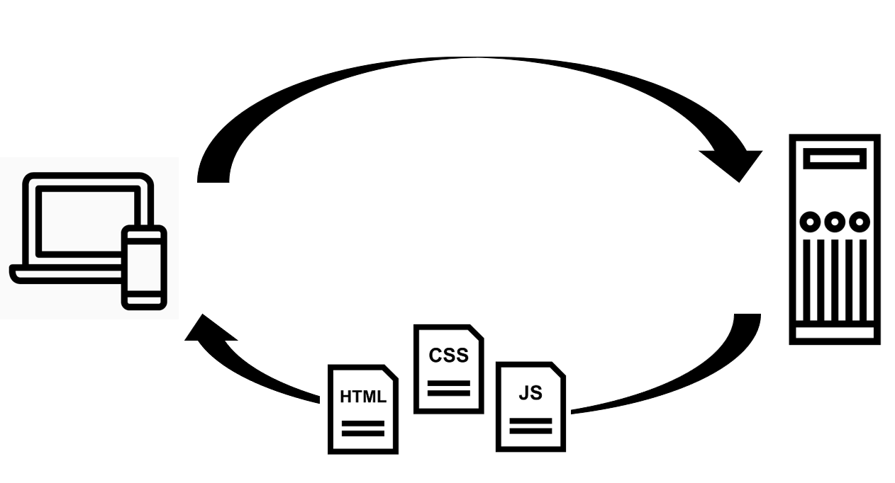

# Introducción al desarrollo Web

## Ciclo petición/respuesta

Cuando consultamos una página Web existen tres elementos fundamentales que entran en juego: la propia red que hace de nexo entre sus elementos, nuestro ordenador que es el que realiza la petición de consulta, y la máquina donde se encuentra almacenada esa página que queremos consultar. [^1]

Conocemos como *servidor* al elemento encargado de servir algún tipo de contenido. En el ejemplo anterior, la máquina que contiene la página de interés es el servidor. También se conoce como servidor el programa que, residiendo en esa máquina, interpreta la petición y la procesa, sirviendo así la página.

El *cliente* es responsable de pedir ese dato al servidor, tomarlo y trabajar con él. Nuestro navegador Web es el cliente en este caso, ya que es el que realiza la petición.

El proceso mediante el que podemos ver esa página en un navegador Web comprende los cuatro pasos siguientes:

1. El cliente realiza la petición.
2. La petición se conduce a través de la red hasta el servidor.
3. El servidor busca la página y la devuelve a través de la red en caso de encontrarla, o devuelve una pagina de error en caso de no tenerla.
4. El cliente recibe la página y la representa.

Ciclo petición/respuesta [^2] Imagenes de Chaowalit Koetchuea, iconsmind.com, Alfredo @ IconsAlfredo.com.

## Front-End y Back-End

Front end y back end son términos que se refieren a la separación de intereses entre una capa de presentación y una capa de acceso a datos, respectivamente. Según el contexto, para referirse a front end se usan otros términos como frontal o interfaz de usuario,1​ mientras que a back end se le llama servidor, motor o modo administrador. [^3]

### Programación por capas

La programación por capas es un modelo de desarrollo software en el que el objetivo primordial es la separación (desacoplamiento) de las partes que componen un sistema software o también una arquitectura cliente-servidor: lógica de negocios, capa de presentación y capa de datos. De esta forma, por ejemplo, es sencillo y mantenible crear diferentes interfaces sobre un mismo sistema sin requerirse cambio alguno en la capa de datos o lógica. [^4]

El más utilizado actualmente es el diseño en tres niveles (o en tres capas).

Arquitectura de tres capas

#### Capas

1. **Capa de presentación:** la que ve el usuario, presenta el sistema al usuario, le comunica la información y captura la información del usuario. También es conocida como interfaz gráfica. Esta capa se comunica únicamente con la capa de negocio. *(Front-End)*

2. **Capa de negocio:** es donde residen los programas que se ejecutan, se reciben las peticiones del usuario y se envían las respuestas tras el proceso. Se denomina capa de negocio o de lógica del negocio porque es aquí donde se establecen todas las reglas que deben cumplirse. Esta capa se comunica con la capa de presentación, para recibir las solicitudes y presentar los resultados, y con la capa de datos, para solicitar al gestor de base de datos almacenar o recuperar datos de él. *(Back-End)*

3. **Capa de datos:** es donde residen los datos y es la encargada de acceder a los mismos. Está formada por uno o más gestores de bases de datos que realizan todo el almacenamiento de datos, reciben solicitudes de almacenamiento o recuperación de información desde la capa de negocio. *(Back-End)*

Todas estas capas pueden residir en un único ordenador, si bien lo más usual es que haya una multitud de ordenadores en donde reside la capa de presentación (son los clientes de la arquitectura cliente/servidor). Las capas de negocio y de datos pueden residir en el mismo ordenador.

## ¿Qué hacen HTML/CSS/JS?

### The White Cat Danced

<del>The</del>

*White* = **CSS** - adjetivos/estilo

*Cat* = **HTML** - sustantivos/estructura

*Danced* = **JS** - verbos/acciones

### HTML

**HTML**, siglas en inglés de *HyperText Markup Language* (‘lenguaje de marcas de hipertexto’), hace referencia al lenguaje de marcado para la elaboración de páginas web. Es un estándar que sirve de referencia del software que conecta con la elaboración de páginas web en sus diferentes versiones, define una estructura básica y un código (denominado código HTML) para la definición de contenido de una página web, como texto, imágenes, videos, juegos, entre otros.

HTML es un lenguaje de marcado que nos permite indicar la estructura de nuestro documento mediante etiquetas. Este lenguaje nos ofrece una gran adaptabilidad, una estructuración lógica y es fácil de interpre­tar tanto por humanos como por máquinas. [^5]

"Hipertexto" se refiere a enlaces que conectan páginas web entre sí, ya sea dentro de un único sitio web o entre sitios web. Los enlaces son un aspecto fundamental de la Web. [^6]

### CSS o Hojas de estilo en cascada

**CSS** (siglas en inglés de **C**ascading **S**tyle **S**heets), en español *«Hojas de estilo en cascada»*, es un lenguaje de diseño gráfico para definir y crear la presentación de un documento estructurado escrito en un lenguaje de marcado.​ Es muy usado para establecer el diseño visual de los documentos web, e interfaces de usuario escritas en HTML.

CSS está diseñado principalmente para marcar la separación del contenido del documento y la forma de presentación de este, características tales como las capas o layouts, los colores y las fuentes. 

La especificación CSS describe un esquema prioritario para determinar qué reglas de estilo se aplican si más de una regla coincide para un elemento en particular. Estas reglas son aplicadas con un sistema llamado de cascada, de modo que las prioridades son calculadas y asignadas a las reglas, así que los resultados son predecibles. [^7]

### JS (JavaScript)

**JavaScript** (abreviado comúnmente **JS**) es un lenguaje de programación interpretado, dialecto del estándar *ECMAScript*. Se define como orientado a objetos,​ basado en prototipos, imperativo, débilmente tipado y dinámico.

Se utiliza principalmente del lado del cliente, implementado como parte de un navegador web permitiendo mejoras en la interfaz de usuario y páginas web dinámicas y JavaScript del lado del servidor (Server-side JavaScript o SSJS). Su uso en aplicaciones externas a la web, por ejemplo en documentos PDF, aplicaciones de escritorio (mayoritariamente widgets) es también significativo. 

!!! note
    Java y JavaScript tienen semánticas y propósitos diferentes. 

Todos los navegadores modernos interpretan el código JavaScript integrado en las páginas web. Para interactuar con una página web se provee al lenguaje JavaScript de una implementación del *Document Object Model* (DOM). [^8]

#### Document Object Model (DOM)

**Document Object Model** o **DOM** ('Modelo de Objetos del Documento' o 'Modelo en Objetos para la Representación de Documentos') es esencialmente una interfaz de plataforma que proporciona un conjunto estándar de objetos para representar documentos HTML, XHTML y XML, un modelo estándar sobre cómo pueden combinarse dichos objetos, y una interfaz estándar para acceder a ellos y manipularlos. A través del DOM, los programas pueden acceder y modificar el contenido, estructura y estilo de los documentos HTML y XML, que es para lo que se diseñó principalmente. [^9]

## Referencias 

[^1]: https://volaya.github.io/libro-sig/chapters/Cliente_servidor.html
[^2]: https://thenounproject.com
[^3]: https://es.wikipedia.org/wiki/Front_end_y_back_end
[^4]: https://es.wikipedia.org/wiki/Programaci%C3%B3n_por_capas
[^5]: https://es.wikipedia.org/wiki/HTML
[^6]: https://developer.mozilla.org/es/docs/Web/HTML
[^7]: https://es.wikipedia.org/wiki/Hoja_de_estilos_en_cascada
[^8]: https://es.wikipedia.org/wiki/JavaScript
[^9]: https://es.wikipedia.org/wiki/Document_Object_Model
