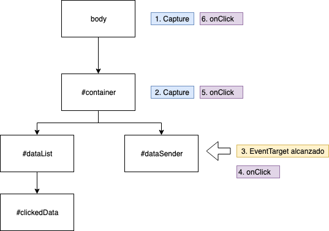
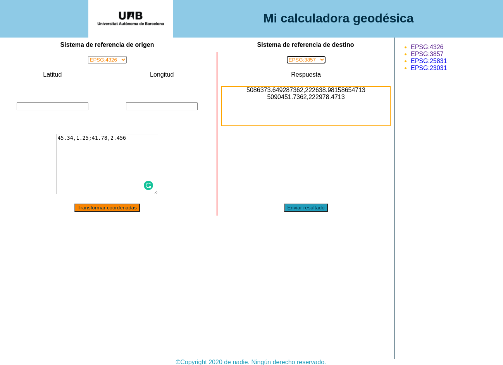

# API del DOM

## ¿Qué es el DOM?

El DOM (Document Object Model) es la estructura en forma de árbol que representa una página web en el navegador. Cada etiqueta HTML es un nodo dentro del DOM y podemos manipularlo con JavaScript para modificar el contenido, el estilo o la estructura de la página.

El modelo de objeto de documento (DOM) es una interfaz de programación para los documentos HTML y XML. Facilita una representación estructurada del documento y define de qué manera los programas pueden acceder, al fin de modificar, tanto su estructura, estilo y contenido. El DOM da una representación del documento como un grupo de nodos y objetos estructurados que tienen propiedades y métodos. Esencialmente, conecta las páginas web a scripts o lenguajes de programación. [^1]

El DOM no es un lenguaje de programación pero sin él, el lenguaje JavaScript no tiene ningún modelo o noción de las páginas web, de la páginas XML ni de los elementos con los cuales es usualmente relacionado.

No se tiene que hacer nada especial para empezar a utilizar el DOM. Todos los navegadores web usan el modelo de objeto de documento para hacer accesibles las páginas web al script. Cuando se crea o se carga un script o inmediatamente está disponible para usarlo con el API del DOM.

## Interfaces esenciales en el DOM

**document** y **window** son objetos cuya interfaces son generalmente muy usadas en la programación de DOM. En término simple, el objeto *window* representa algo como podría ser el navegador, y el objeto *document* es la raíz del documento en sí. **Element** se refiere a un elemento o a un nodo de tipo de elemento "element" devuelto por un miembro del API de DOM, por ejemplo un *`<div>`*

## Seleccionar Elementos en el DOM

Para interactuar con los elementos de una página, primero debemos seleccionarlos con JavaScript.

### `getElementById()` → Seleccionar un elemento por su `id`

```html
<p id="mensaje">Hola, mundo!</p>
<button onclick="cambiarTexto()">Cambiar Texto</button>

<script>
function cambiarTexto() {
    let elemento = document.getElementById("mensaje");  // Seleccionamos el elemento
    elemento.textContent = "Texto cambiado con JavaScript!";
}
</script>
```

### `querySelector()` y `querySelectorAll()` → Seleccionar elementos con selectores CSS

* `querySelector()` selecciona **solo el primer** elemento que coincida con el selector CSS.
* `querySelectorAll()` selecciona **todos** los elementos coincidentes y devuelve una lista.

``` html
<p class="parrafo">Este es un párrafo.</p>
<p class="parrafo">Este es un párrafo 2.</p>
<button onclick="cambiarColor()">Cambiar Color</button>

<script>
function cambiarColor() {
    let elemento = document.querySelector(".parrafo");  // Selecciona el primer elemento con la clase "parrafo"
    elemento.style.color = "red";  // Cambia el color del texto a rojo
}
</script>
```

Ejemplo con `querySelectorAll()`:

``` js
let elementos = document.querySelectorAll(".parrafo");
elementos.forEach(p => p.style.fontSize = "20px");  // Cambia el tamaño de todos los párrafos
```

## Otros metodos de acceso a elementos del DOM

Para acceder a los diferentes elementos de una página web podemos usar los siguientes métodos

``` js
// Obtiene una lista con los elementos que tienen esa clase
document.getElementsByClassName('algunaclase');

// Obtiene una HTMLCollection con los todos los elementos 'li'
document.getElementsByTagName('li');
```

Una vez tenemos un elemento seleccionado podemos acceder a sus padres/hijos

``` js
var elem = document.getElementById('someid');
// Obtener los hijos de un elemento
var hijos = elem.childNodes;

// Su nodo padre
var padre = elem.parentNode;
```

## Crear nuevos elementos

Para crear elementos llamamos a **createElement** con el nombre del elemento

``` js
var nuevoH1 = document.createElement('h1');
var nuevoParrafo = document.createElement('p');
```

Para añadir texto a los elementos podemos usar el método createTextNode o también podemos asignar directamente el valor a la propiedad innerHTML

``` js
var nuevoH1 = document.createElement('h1');
var nuevoParrafo = document.createElement('p');

var textoH1 = document.createTextNode('Hola mundo!');
// Añadir el texto a los elementos
nuevoH1.appendChild(textoH1);
nuevoParrafo.innerHTML = 'lorem ipsum...';
```

!!! nota

    Crear un elemento con el createElement no agrega directamente el elemento en nuestra página. Para ello debemos agregarlo a algún otro elemento con el médoto appendChild

``` html
<ul id="lista"></ul>
<button onclick="agregarElemento()">Agregar Elemento</button>

<script>
function agregarElemento() {
    let nuevoElemento = document.createElement("li");  // Creamos un nuevo <li>
    nuevoElemento.textContent = "Nuevo ítem";  // Agregamos texto al <li>

    let lista = document.getElementById("lista");
    lista.appendChild(nuevoElemento);  // Agregamos el <li> a la lista <ul>
}
</script>
```

## Añadir/eliminar/modificar Clases

Podemos acceder a las clases de un elemento y manipularas para cambiar el estilo del elememto

``` js
// Tomamos un elemento
var cabecera = document.getElementById('cabecera');

// elimina una clase del elemento
cabecera.classList.remove('foo');

// Añade una clase si no existe
cabecera.classList.add('otra');

// añade o elimina varias clases a la vez
cabecera.classList.add('foo', 'bar');
cabecera.classList.remove('foo', 'bar');

// Si la clase existe la elimina, si no existe, la crea
cabecera.classList.toggle('visible');

// Devuelve true si el elemento contiene esa clase
cabecera.classList.contains('foo');
```

## Manipular el estilo

Podemos agregar estilos en linea directamente a los elementos

``` js
// Tomamos un elemento
var cabecera = document.getElementById('cabecera');
// Modificamos su estilo
cabecera.style.color = 'white';
cabecera.style.backgroundColor = 'black';
cabecera.style.padding = '10px';
cabecera.style.width = '250px';
cabecera.style.textAlign = 'center';
```

## Eventos

Los eventos en JavaScript permiten ejecutar código cuando el usuario hace clic, pasa el mouse, escribe en un input, etc.

Hay tres formas de registrar gestores de eventos para un elemento. [^2]

### Atributo HTML

Debe evitarse esta forma. Hace que el HTMl sea más grande y menos legible. El contenido/estructura y el comportamiento no están bien separados, por lo que es más difícil encontrar un error.

Ejemplo

``` html
<button onclick="alert('Hello world!')">
```

### Propiedades del elemento

El problema con este método es que solo se puede establecer un gestor por elemento y por evento.

Ejemplo

``` js
// Se supone que myButton es un elemento de botón
myButton.onclick = function(event){alert('Hello world');};
```

### addEventListener

Este es el método que debemos usar preferiblemente en lugar de los otros 2 métodos

Ejemplo

``` html
<button id="boton">Haz clic</button>

<script>
let boton = document.getElementById("boton");

boton.addEventListener("click", function() {
    alert("¡Has hecho clic!");
});
</script>
```

La sintaxis más usada es la siguiente [^3]

``` js
// Se supone que target es un elemento
target.addEventListener(tipo, funcion listener [, opciones] );
```

Donde *tipo* es una cadena que representa un tipo de evento a escuchar. Algunos de los eventos más comunes son *click*, *load*, *change*, *keypress*. Para ver un listado de los eventos ir a https://developer.mozilla.org/es/docs/Web/Events

Donde *funcion listener* es una función que recibe como parámetro un evento. Si queremos pasar parámetros a la función del listener, debes utilizar funciones anónimas.

Donde *opciones* es opcional y puede servir para indicar el *useCapture* indica que el usuario desea iniciar en evento en la captura o tambíen para especificar las características del evento. 

Ejemplo

``` js
// Funcion para cambiar el contenido de t2
function modifyText(new_text) {
  var t2 = document.getElementById("t2");
  t2.firstChild.nodeValue = new_text;
}

// Funcion para agregar el evento a t
function load() {
  var el = document.getElementById("t");
  el.addEventListener("click", function(){modifyText("four")}, false);
}
```

#### Eventos de Mouse

Podemos detectar cuando el usuario mueve el mouse o pasa sobre un elemento.

``` html
<p id="mensaje">Pasa el mouse aquí</p>

<script>
let mensaje = document.getElementById("mensaje");

mensaje.addEventListener("mouseover", function() {
    mensaje.style.color = "blue";  // Cambia el color cuando el mouse pasa
});

mensaje.addEventListener("mouseout", function() {
    mensaje.style.color = "black";  // Vuelve al color original cuando el mouse se va
});
</script>
```

#### Eventos de Teclado

Podemos capturar lo que el usuario escribe en un input.

``` html
<input type="text" id="nombre" placeholder="Escribe algo">
<p id="resultado"></p>

<script>
let input = document.getElementById("nombre");
let resultado = document.getElementById("resultado");

input.addEventListener("input", function() {
    resultado.textContent = "Escribiste: " + input.value;
});
</script>
```

* **input** → Se activa cuando el usuario escribe en un input.
* **keydown** → Detecta cuando el usuario presiona una tecla.
* **keyup** → Detecta cuando el usuario suelta una tecla.

### removeEventListener

Si queremos quitar un evento previamente registrado debemos usar el método **removeEventListener**. La sintaxis es igual a la del *addEventListener*

Ejemplo

``` html
<button id="detener">Detener evento</button>
<button id="clickMe">Haz clic</button>

<script>
function mostrarAlerta() {
    alert("Evento activo");
}

let boton = document.getElementById("clickMe");
boton.addEventListener("click", mostrarAlerta);

document.getElementById("detener").addEventListener("click", function() {
    boton.removeEventListener("click", mostrarAlerta);
    alert("Evento eliminado");
});
</script>
```

Solo se puede quitar si la función está declarada **aparte** (no como función anónima).

#### Ejercicios Prácticos

!!! example "Contador de clics"

	1. Crear un contador de clics que aumente cada vez que el usuario haga clic en un botón y se pueda reiniciar mediante otro boton.

!!! example "Cambiar el fondo de la página con botones"

	1. Crea tres botones que permitan cambiar el fondo de la página a rojo, verde o azul al hacer clic en ellos.

!!! example "Contador con tecla Enter"

	1. Crea un contador que aumente en 1 cada vez que el usuario presione la tecla Enter.

!!! example "Mostrar/Ocultar un párrafo"

	1. Crea un botón que muestre u oculte un párrafo al hacer clic en él.

!!! example "Validación de formulario en tiempo real"

	1. Crea un input donde el usuario escriba su nombre. Si el nombre tiene menos de 3 caracteres, muestra un mensaje de error en rojo.		

### dispatchEvent

Lanza un evento en el sistema de eventos. El evento está sujeto al mismo comportamiento y capacidades que si fuera un evento de lanzamiento directo.

`dispatchEvent` es un método que nos permite disparar eventos "manualmente" en cualquier elemento del DOM.
Esto es útil cuando queremos simular eventos o desencadenar acciones de manera controlada.

La sintaxis es la siguiente

``` js
element.dispatchEvent(event)
```

Event es un objeto de tipo evento.

Ejemplo

``` html
<button id="miBoton">Haz clic</button>

<script>
let boton = document.getElementById("miBoton");

// Evento real
boton.addEventListener("click", function() {
    alert("¡Botón clickeado!");
});

// Disparar el evento después de 2 segundos
setTimeout(() => {
    let eventoClick = new Event("click");
    boton.dispatchEvent(eventoClick);
}, 2000);
</script>
```

## Eventos personalizados

Podemos crear eventos personalizados usando el constructor **CustomEvent**.

Los eventos personalizados permiten enviar datos cuando se activan.

Ejemplo

``` js
let eventoPersonalizado = new CustomEvent("saludo", {
    detail: { mensaje: "Hola desde un evento personalizado!" }
});

document.addEventListener("saludo", function(event) {
    console.log(event.detail.mensaje);
});

document.dispatchEvent(eventoPersonalizado);
```

## Propagación de eventos

Cuando hay dos elementos superpuestos, y ambos tienen asociadas acciones para responder a un mismo evento, surge la duda de en qué orden se ejecutan las acciones. Por defecto el evento se va propagando desde el elemento más interno hacia afuera, hasta alcanzar el elemento más externo (fase **bubble**). Si queremos realizar alguna acción durante las dos fases anteriores deberemos declararlo del siguiente modo: [^4]

``` js
// Se supone que myButton es un elemento de botón
myButton.removeEventListener('click', function(){alert('Hello world');}, true);
```

Ejemplo 

``` js
const body = document.querySelector('body');
const container = document.querySelector('#container'); 
const button = document.querySelector('#dataSender');
body.addEventListener('click', function(event) { 
  console.log('body clicked');
});
container.addEventListener('click', function(event) { 
  console.log('container clicked');
});
button.addEventListener('click', function(event) { 
  console.log('button clicked');
});
button.addEventListener('click', function(event) { 
  console.log('button clicked 2');
});
```



### Detener la propagación

En el caso de que queramos detener la propagación del evento en algún punto determinado del DOM podremos emplear los métodos **event.stopPropagation()** o **event.stopImmediatePropagation()**

El **event.stopPropagation()** evita que el evento "suba en burbuja" pero si permite que se ejecuten más eventos asociados a ese elemento.

Ejemplo. En este caso se ejecutarian el *button clicked* y el *button clicked 2*

``` js
const body = document.querySelector('body');
const container = document.querySelector('#container'); 
const button = document.querySelector('#dataSender');
body.addEventListener('click', function(event) { 
  console.log('body clicked');
});
container.addEventListener('click', function(event) { 
  console.log('container clicked');
});
button.addEventListener('click', function(event) {
  event.stopPropagation();
  console.log('button clicked');
});
button.addEventListener('click', function(event) { 
  console.log('button clicked 2');
});
```

Sin embargo si queremos prevenir que se ejecuten otros eventos asociados al mismo elemento podemos emplear el método **event.stopImmediatePropagation()**.

Ejemplo. En este caso sólo se ejecutarian el *button clicked*

``` js
const body = document.querySelector('body');
const container = document.querySelector('#container'); 
const button = document.querySelector('#dataSender');
body.addEventListener('click', function(event) { 
  console.log('body clicked');
});
container.addEventListener('click', function(event) { 
  console.log('container clicked');
});
button.addEventListener('click', function(event) {
  event.stopImmediatePropagation();
  console.log('button clicked');
});
button.addEventListener('click', function(event) { 
  console.log('button clicked 2');
});
```

Otro método común es el **event.preventDefault()** que se usa para evitar que el navegador ejecute el comportamiento por defecto del evento recibido. El caso más común es en los elementos de enlaces `<a>` cuando queremos usarlos como botones en vez de como enlaces.

Ejemplo. Prevenir que el navegador vaya hacia la url del enlace cuando el usuario haga click sobre él

``` js
const link = document.querySelector('#myLink');
link.addEventListener('click', function(event) {
  event.preventDefault();
  // do something cool
});
```

####  Ejercicios entregables

!!! question "Calculadora geodésica"

	A continuación vamos a modificar nuestro archivo **script.js** que se encuentra dentro de la carpeta *js* para agregar alguna funcionalidad a nuestra calculadora

	1. Agregar un evento click al botón de tranformar coordenadas

		``` js
		const btnTransformar = document.querySelector(".btn-tranformar");

		btnTransformar.addEventListener("click", (evt) => {
				console.log("Transformar coordenadas");
		});
		```

	2. Crear una función para transformar coordenadas

		``` js hl_lines="7 8 9 10 11"
		const btnTransformar = document.querySelector(".btn-tranformar");

		btnTransformar.addEventListener("click", (evt) => {
				console.log("Transformar coordenadas");
		});

		const transformarCoordenadas = (lat, lon, epsg_in, epsg_out) => {

				console.log(`Tranformar la coordenada ${lat},${lon} del ${epsg_in} al ${epsg_out}`);

		}
		```

	3. Llamar a la función *transformarCoordenadas* cuando se hace click en el botón

		``` js hl_lines="5"
		const btnTransformar = document.querySelector(".btn-tranformar");

		btnTransformar.addEventListener("click", (evt) => {
				console.log("Transformar coordenadas");
				transformarCoordenadas(41.5, 2, "EPSG:4326", "EPSG:25831");
		});

		const transformarCoordenadas = (lat, lon, epsg_in, epsg_out) => {

				console.log(`Tranformar la coordenada ${lat},${lon} del ${epsg_in} al ${epsg_out}`);

		}
		```

	4. Leer el valor del sistema de referencia de origen seleccionado

		``` js hl_lines="5 6"
		const btnTransformar = document.querySelector(".btn-tranformar");

		btnTransformar.addEventListener("click", (evt) => {
				console.log("Transformar coordenadas");
				const srs_origen = document.getElementById("origen").value;
				transformarCoordenadas(41.5, 2, srs_origen, "EPSG:25831");
		});

		const transformarCoordenadas = (lat, lon, epsg_in, epsg_out) => {

				console.log(`Tranformar la coordenada ${lat},${lon} del ${epsg_in} al ${epsg_out}`);

		}
		```
	5. Modificar el archivo **index.html** para agregar un div donde mostrar el resultado de la transformación

		``` html hl_lines="53"
		<!DOCTYPE html>
		<html lang="es">
		<head>
			<meta charset="UTF-8">
			<meta name="author" content="[VUESTRO NOMBRE]">
			<meta name="description" content="Calculadora geodésica que permite hacer la transformación de coordenadas geográficas en linea">
			<meta name="viewport" content="width=device-width, initial-scale=1.0">
			<link href="https://www.icgc.cat/bundles/microblauicgc/img/favicon.ico" rel="shortcut icon" type="image/x-icon">
			<link rel="preconnect" href="https://fonts.gstatic.com">
			<link href="https://fonts.googleapis.com/css2?family=Roboto:ital,wght@0,300;0,400;0,700;1,400;1,700&display=swap" rel="stylesheet">
			<link type="text/css" href="css/estilos.css" rel="stylesheet">
			<title>Mi calculadora geodésica</title>
			<script src="js/script.js" defer></script>
		</head>
		<body>
			<header>
				
				<h1>Mi calculadora geodésica</h1>
			</header>
			<main>
				<div>
					<table>
						<tr>
							<th colspan="2"><label for="origen">Sistema de referencia de origen</label></th>
							<th colspan="2"><label for="destino">Sistema de referencia de destino</label></th>
						</tr>
						<tr>
							<td colspan="2">
								<select id="origen">
									<option value="EPSG:4326">EPSG:4326</option> 
									<option value="EPSG:3857">EPSG:3857</option>
									<option value="EPSG:25831">EPSG:25831</option>
									<option value="EPSG:23031">EPSG:23031</option>
								</select>
							</td>
							<td colspan="2">
								<select id="destino">
									<option value="EPSG:4326">EPSG:4326</option> 
									<option value="EPSG:3857">EPSG:3857</option>
									<option value="EPSG:25831">EPSG:25831</option>
									<option value="EPSG:23031">EPSG:23031</option>
								</select>
							</td>
						</tr>
						<tr>
							<td><label for="lat">Latitud</label></td>
							<td><label for="lng">Longitud</label></td>
							<td colspan="2"></td>
						</tr>
						<tr>
							<td><input type="text" id="lat"></td>
							<td><input type="text" id="lng"></td>
							<td colspan="2"><div id="respuesta"></div></td>
						</tr>
						<tr>
							<td colspan="4"><button class="btn-tranformar">Transformar coordenadas</button></td>
						</tr>
					</table>
				</div>
				<aside>
					<ul>
						<li><a href="https://epsg.io/4326" title="WGS 84 -- WGS84 - World Geodetic System 1984, used in GPS" target="_blank" rel="noopener noreferrer">EPSG:4326</a></li>
						<li>EPSG:3857</li>
						<li>EPSG:25831</li>
						<li>EPSG:23031</li>
					</ul>
				</aside>
			</main>
			<footer>©Copyright 2020 de nadie. Ningún derecho reservado.</footer>
		</body>
		</html>
		```

	6. Mostrar la repuesta de la transformación

		``` js hl_lines="7 12"
		const btnTransformar = document.querySelector(".btn-tranformar");

		btnTransformar.addEventListener("click", (evt) => {
				console.log("Transformar coordenadas");
				const srs_origen = document.getElementById("origen").value;
				const coordTransformada = transformarCoordenadas(41.5, 2, srs_origen, "EPSG:25831");
				document.getElementById("respuesta").innerHTML = coordTransformada;
		});

		const transformarCoordenadas = (lat, lon, epsg_in, epsg_out) => {

				return `Tranformar la coordenada ${lat},${lon} del ${epsg_in} al ${epsg_out}`;

		}
		```

	7. Guardar los archivos modificados y recargar la página. Al presionar el botón de *Transformar coordenadas* debemos ver que nos aparece el texto con el valor del SRS de origen seleccionado.

	8. Cargar la librería proj4 [^5]. Esta librería permite transformar coordenadas entre diferentes sistemas de referencia. Modificar el archivo index.html y agregar la librería.

		``` html hl_lines="13"
		<!DOCTYPE html>
		<html lang="es">
		<head>
			<meta charset="UTF-8">
			<meta name="author" content="[VUESTRO NOMBRE]">
			<meta name="description" content="Calculadora geodésica que permite hacer la transformación de coordenadas geográficas en linea">
			<meta name="viewport" content="width=device-width, initial-scale=1.0">
			<link href="https://www.icgc.cat/bundles/microblauicgc/img/favicon.ico" rel="shortcut icon" type="image/x-icon">
			<link rel="preconnect" href="https://fonts.gstatic.com">
			<link href="https://fonts.googleapis.com/css2?family=Roboto:ital,wght@0,300;0,400;0,700;1,400;1,700&display=swap" rel="stylesheet">
			<link type="text/css" href="css/estilos.css" rel="stylesheet">
			<title>Mi calculadora geodésica</title>
			<script src="https://cdnjs.cloudflare.com/ajax/libs/proj4js/2.6.3/proj4.min.js" crossorigin="anonymous"></script>
			<script src="js/script.js" defer></script>
		</head>
		<body>
			<header>
				
				<h1>Mi calculadora geodésica</h1>
			</header>
			<main>
				<div>
					<table>
						<tr>
							<th colspan="2"><label for="origen">Sistema de referencia de origen</label></th>
							<th colspan="2"><label for="destino">Sistema de referencia de destino</label></th>
						</tr>
						<tr>
							<td colspan="2">
								<select id="origen">
									<option value="EPSG:4326">EPSG:4326</option> 
									<option value="EPSG:3857">EPSG:3857</option>
									<option value="EPSG:25831">EPSG:25831</option>
									<option value="EPSG:23031">EPSG:23031</option>
								</select>
							</td>
							<td colspan="2">
								<select id="destino">
									<option value="EPSG:4326">EPSG:4326</option> 
									<option value="EPSG:3857">EPSG:3857</option>
									<option value="EPSG:25831">EPSG:25831</option>
									<option value="EPSG:23031">EPSG:23031</option>
								</select>
							</td>
						</tr>
						<tr>
							<td><label for="lat">Latitud</label></td>
							<td><label for="lng">Longitud</label></td>
							<td colspan="2"></td>
						</tr>
						<tr>
							<td><input type="text" id="lat"></td>
							<td><input type="text" id="lng"></td>
							<td colspan="2"><div id="respuesta"></div></td>
						</tr>
						<tr>
							<td colspan="4"><button class="btn-tranformar">Transformar coordenadas</button></td>
						</tr>
					</table>
				</div>
				<aside>
					<ul>
						<li><a href="https://epsg.io/4326" title="WGS 84 -- WGS84 - World Geodetic System 1984, used in GPS" target="_blank" rel="noopener noreferrer">EPSG:4326</a></li>
						<li>EPSG:3857</li>
						<li>EPSG:25831</li>
						<li>EPSG:23031</li>
					</ul>
				</aside>
			</main>
			<footer>©Copyright 2020 de nadie. Ningún derecho reservado.</footer>
		</body>
		</html>
		```

	9. Utilizar la librería de proj4 para transformar coordenadas al EPSG:3857

		``` js hl_lines="6 12 14"
		const btnTransformar = document.querySelector(".btn-tranformar");

		btnTransformar.addEventListener("click", (evt) => {
				console.log("Transformar coordenadas");
				const srs_origen = document.getElementById("origen").value;
				const coordTransformada = transformarCoordenadas(41.5, 2, srs_origen, "EPSG:3857");
				document.getElementById("respuesta").innerHTML = coordTransformada;
		});

		const transformarCoordenadas = (lat, lon, epsg_in, epsg_out) => {

				const coordTransformada = proj4(epsg_in, epsg_out, [lon, lat]);

			return `La coordenada ${lat},${lon} en ${epsg_in} corresponde a la coordenada ${coordTransformada[1]},${coordTransformada[0]} en ${epsg_out} `;

		}
		```

	10. Recargar la página y seleccionar como origen el EPSG:4326 y presionar el botón de Transformar coordenadas. Nos debe aparecer el texto con la coordenada transformada. Si seleccionamos otro SRS de origen nos dará un error. Esto es debido a la librería proj4 no tiene definidos todos los SRS.

		!!! note
			Por defecto el *proj4* tiene definidos los siguientes SRS: EPSG:4326, EPSG:4269 y EPSG:3857

	11. Definir un nuevo SRS. Para encontrar la definición de un SRS podemos ir a https://epsg.io/ y buscar el SRS que queremos definir (Ej. https://epsg.io/25831). Vamos al apartado de **Export** de la página y seleccionamos la opción de Proj4js. Copiamos el texto y lo agregamos a nuestra aplicación.

		``` js hl_lines="1"
		proj4.defs("EPSG:25831","+proj=utm +zone=31 +ellps=GRS80 +towgs84=0,0,0,0,0,0,0 +units=m +no_defs");

		const btnTransformar = document.querySelector(".btn-tranformar");

		btnTransformar.addEventListener("click", (evt) => {
			console.log("Transformar coordenadas");
			const srs_origen = document.getElementById("origen").value;
			const coordTransformada = transformarCoordenadas(41.5, 2, srs_origen, "EPSG:3857");
			document.getElementById("respuesta").innerHTML = coordTransformada;
		});

		const transformarCoordenadas = (lat, lon, epsg_in, epsg_out) => {

			const coordTransformada = proj4(epsg_in, epsg_out, [lon, lat]);

			return `La coordenada ${lat},${lon} en ${epsg_in} corresponde a la coordenada ${coordTransformada[1]},${coordTransformada[0]} en ${epsg_out} `;

		}
		```

!!! question "Ejercicio 2.5 pt"
	1. Agregar un nuevo SRS a los selectores y al listado de la barra lateral y agregar la definición de proj4 de los SRS restantes para que la calculadora funcione. **0.5 pt**
	2. Usar los valores de los campos *Latitud* y *Longitud* como coordendad de origen en lugar de la coordenada de origen que tenemos fijada en *41.5,2*. y Usar el valor del selector de SRS de destino para hacer la transformación en lugar del *EPSG:3857* que tenemos fijado como destino. **0.5 pt** 
	3. Modificar la función *transformarCoordenadas* para que retorne la coordenada transformada en lugar de texto actual. **0.5 pt**
	4. Validar que el SRS de origen no sea igual al SRS de destino. En el caso de ser iguales mostrar un mensaje al usuario. El mensaje de error se debe mostrar en un nuevo div. En el caso de ser diferentes ocultar el div con el mensaje de error. **0.5 pt**
	5. Agregar a la tabla un nuevo campo en la columna de origin del tipo textarea donde el usuario podra poner multiples coordenadas de origen separadas por **";"** (punto y comar) por Ejemplo *45.34,1.25;41.78,2.456*. Al presionar el botón de transformar coordenadas validar si el nuevo campo tiene valores tambien realizar la transformación de estos valores y retornarlos en la respuesta. **0.5 pt**

	El resultado debe ser algo como esto
    

## Referencias

[^1]: https://developer.mozilla.org/es/docs/Referencia_DOM_de_Gecko/Introducci%C3%B3n
[^2]: https://developer.mozilla.org/es/docs/Referencia_DOM_de_Gecko/Eventos
[^3]: https://developer.mozilla.org/es/docs/Web/API/EventTarget/addEventListener
[^4]: https://latteandcode.medium.com/javascript-y-eventos-todo-lo-que-necesitas-saber-8b8ba4a2d4d4
[^5]: http://proj4js.org/


