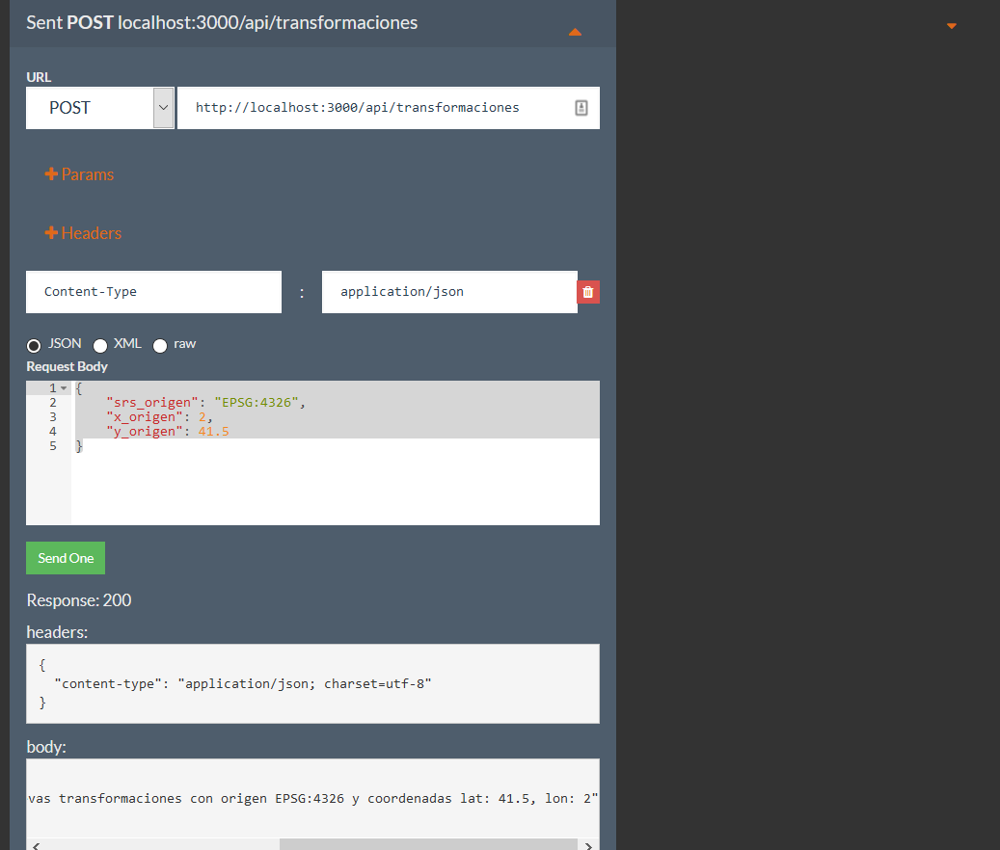

# JS en el servidor

Dentro del desarrollo web, el backend se encarga de todos los procesos necesarios para que la web funcione de forma correcta. Estos procesos o funciones no son visibles, pero tienen mucha importancia en el buen funcionamiento de un sitio web. Algunas de estas acciones que controla el backend son la conexión con la base de datos o la comunicación con el servidor de hosting.

El desarrollo del backend se puede hacer usando diferentes lenguajes de programación como PHP, Java, .Net, Python, Node.js, etc. En nuestro caso usaremos Node.js[^1] ya que es un entorno de ejecución multiplataforma basado en JavaScript. 

!!! warning
    Este **NO** es un curso de Node.js. únicamente explicaremos un ejemplo de cómo montar un servidor con Node.js que permita leer y escribir datos en una Base de datos con PostgreSQL. Tampoco es un curso de base de datos y se asume que ya se tienen conocimientos previos de trabajar con PostgreSQL.

## Servidor Node.js

Para crear nuestro servidor con Node.js usaremos Express[^2]. **Express** es una infraestructura de aplicaciones web Node.js mínima y flexible que proporciona un conjunto sólido de características para las aplicaciones web y móviles.

1. Crear una carpeta llamada **servidor**

2. Abrir un terminal dentro de esa carpeta y ejecutar el siguiente comando

    ```
    npm init -y
    ```

3. A continuación, instale *Express* en el directorio y guárdelo en la lista de dependencias.

    ```
    npm i express
    ```

4. En el directorio *servidor* crear un archivo llamado app.js y copie el sigueinte código:

    ``` js
    const express = require('express');
    const app = express();
    const port = 3000;

    app.get('/', (req, res) => {
    res.send('Hello World!')
    });

    app.listen(port, () => {
    console.log(`Example app listening at http://localhost:${port}`)
    });
    ```

5. Guarde el archivo y abrir la pagina http://localhost:3000/ en el navegador para ver que el servidor está funcionando.

6. Crear la base de datos, en PostgreSQL crear una nueva base de datos llamada **node_ejemplo** (o usar una existente). Dentro de esa base de datos crear una tabla llamada **tranformacion**. Esta tabla debe contener 6 columnas: srs_origen, x_origen, y_origen, srs_destino, x_destino, y_destino. Las columnas de srs deben ser de tipo texto y el resto de tipo numérico

    ``` sql
    CREATE TABLE public.transformacion
    (
    srs_origen character varying(5) COLLATE pg_catalog."default" NOT NULL,
    x_origen numeric NOT NULL,
    y_origen numeric NOT NULL,
    srs_destino character varying(5) COLLATE pg_catalog."default" NOT NULL,
    x_destino numeric NOT NULL,
    y_destino numeric NOT NULL,
    id SERIAL PRIMARY KEY NOT NULL
    )
    ```

7. Instalar el node-postgres una librería de Node.js que nos permite conectar con bases de datos de PostgreSQL

    ```
    npm i pg
    ```

8. Crear el archivo de configuración para conectar con la BD desde Node. Dentro de la carpeta *servidor* crear una nueva carpeta llamada **db**. Dentro de esta carpeta crear un archivo llamado **db.js** y copiar el siguiente código

    ``` js
    const { Pool } = require("pg");

    const config = {    
        user: '[TU_USUARIO]',
        host: 'localhost',
        database: 'node_ejemplo',
        password: '[TU_CONTRASEÑA]',
        port: 5432,
    };

    const pool = new Pool(config);

    module.exports = {
        query: (text, params) => pool.query(text, params),
    };
    ```

9. Instalar otras dependencias

    ```
    npm i cors body-parser
    ```

10. Modificar el servidor para cargar el archivo de configuración de la Bd y crear la ruta de la API. Modificar el archivo app.js y escribir lo siguiente

    ``` js hl_lines="2 3 4 9 10 11 12 14 15 16 18"
    const express = require('express');
    const bodyParser = require("body-parser");
    const cors = require("cors");
    const apiRoutes = require("./routes/api");

    const app = express();
    const port = 3000;

    app.use(bodyParser.json());
    app.use(bodyParser.urlencoded({ extended: false }));
    app.use(bodyParser.raw());
    app.use(cors());

    app.get('/', (request, response) => {
        response.json({ info: 'Node.js, Express, and Postgres API' })
    });

    app.use("/api/", apiRoutes());

    app.listen(port, () => {
    console.log(`Example app listening at http://localhost:${port}`)
    });
    ```

11. Crear el router para procesar las peticiones. Crear una carpeta llamada **routes** dentro de la carpeta *servidor*. Dentro de la carpeta *routes crear un archivo llamado **api.js** y escribir lo siguiente

    ``` js
    const Router = require("express").Router;

    module.exports = () => {

        const api = new Router();

        api.get("/transformaciones", async (req, res) => {

            res.json({repuesta: `se debe retornar el listado de todas las transformaciones`});

        })

        api.get("/transformaciones/:id", async (req, res) => {

            const { id } = req.params;
            res.json({repuesta: `se debe retornar la transformación con id = ${id}`});

        });

        api.post("/transformaciones", async (req, res) => {

            console.log(req.body);
            const { srs_origen, x_origen, y_origen } = req.body;

            res.json({repuesta: `llamada post para insertar nuevas transformaciones con origen ${srs_origen} y coordenadas lat: ${y_origen}, lon: ${x_origen}`});

        });

        return api;

    };
    ```

12. Reiniciar el servidor de Node.js y luego volverlo a arrancarlo para que los cambios hechos tengan efecto

    Ctrl+c
    
    ```
    node app.js
    ```

13. Probar nuestra API. Para las peticiones GET podemos probarlas directamente desde nuestro navegador. Podemos escribir http://localhost:3000/api/transformaciones/24 o http://localhost:3000/api/transformaciones y debemos ver la respuesta correspondiente.


14. Para probar la peticiones POST podemos abrir un navegador he ir a https://www.apirequest.io/. En el selector seleccionar la opción de POST y en el campo para la URL poner http://localhost:3000/api/transformaciones. Luego agregar el header "Content-Type"=application/json y en el Request Body copiar 

    ``` js
    {
        "srs_origen": "4326",
        "x_origen": 2,
        "y_origen": 41.5,
        "srs_destino": "3857",
        "x_destino": 222638.9815,
        "y_destino": 5086373.6492
    }
    ```

    
 
15. Crear las funciones que realizan las querys a nuestra base de datos. Crear una nueva carpeta llamada **services** dentro de la carpeta *servidor*. Dentro de la nueva carpeta crear un archivo llamado **transformaciones.js** y copiar lo siguiente dentro del archivo

    ``` js
    const db = require("../db/db");

    class TransformacionesService {

        static async getTransformaciones() {

            const SQL = "SELECT * FROM public.transformacion";

            const {rows} = await db.query(SQL);

            return rows;

        }
        
        static async getTransformacionById(id) {

            const SQL = "SELECT * FROM public.transformacion WHERE id = $1";

            const {rows} = await db.query(SQL, [id]);

            return rows;

        }


        static async createTransformacion(srs_origen, x_origen, y_origen, srs_destino, x_destino, y_destino) {

            const SQL = "INSERT INTO public.transformacion (srs_origen, x_origen, y_origen, srs_destino, x_destino, y_destino) VALUES ($1, $2, $3, $4, $5, $6) RETURNING *";

            const {rows} = await db.query(SQL, [srs_origen, x_origen, y_origen, srs_destino, x_destino, y_destino]);

            return rows;

        }

    }

    module.exports = TransformacionesService;
    ```

16. Conectar nuestra API con la base de datos. Modificar el archivo *api.js* 

    ``` js hl_lines="11 18 25"
    const Router = require("express").Router;

    const TransformacionesService = require("../services/transformaciones");

    module.exports = () => {

        const api = new Router();

        api.get("/transformaciones", async (req, res) => {

            res.json(await TransformacionesService.getTransformaciones());

        })

        api.get("/transformaciones/:id", async (req, res) => {

            const { id } = req.params;
            res.json(await TransformacionesService.getTransformacionById(id));

        });

        api.post("/transformaciones", async (req, res) => {

            const { srs_origen, x_origen, y_origen, srs_destino, x_destino, y_destino } = req.body;
            res.json(await TransformacionesService.createTransformacion(srs_origen, x_origen, y_origen, srs_destino, x_destino, y_destino));

        });

        return api;

    };
    ```

17. Probar nuestra API. Parar y arrancar el servidor de Node.js y volver a hacer la llamada POST desde el navegador. Se debería crear un nuevo registro en la base de datos. Para consultar el registro podemos abrir http://localhost:3000/api/transformaciones o http://localhost:3000/api/transformaciones/1

!!! note
    Este servidor es un demostrador de la funcionalidad básica de la implementación de una API. En el mismo no se hace control de errores, ni validación de valores de entrada, etc. **NO es un servidor para producción**

## Modificar la calculadora

1. Modificar nuestra aplicación para llamar a la API. Modificar nuestro archivo **index.html** que se encuentra en la carpeta *web-mgeo* y agregar un nuevo boton en el area de la respuesta. 

    ``` html hl_lines="59"
    <!DOCTYPE html>
    <html lang="es">
    <head>
        <meta charset="UTF-8">
        <meta name="author" content="[VUESTRO NOMBRE]">
        <meta name="description" content="Calculadora geodésica que permite hacer la transformación de coordenadas geográficas en linea">
        <meta name="viewport" content="width=device-width, initial-scale=1.0">
        <link href="https://www.icgc.cat/bundles/microblauicgc/img/favicon.ico" rel="shortcut icon" type="image/x-icon">
        <link rel="preconnect" href="https://fonts.gstatic.com">
        <link href="https://fonts.googleapis.com/css2?family=Roboto:ital,wght@0,300;0,400;0,700;1,400;1,700&display=swap" rel="stylesheet">
        <link type="text/css" href="css/estilos.css" rel="stylesheet">
        <title>Mi calculadora geodésica</title>
        <script src="https://cdnjs.cloudflare.com/ajax/libs/proj4js/2.6.3/proj4.min.js" integrity="sha512-TzmbpBIqcR0TyAdg+zJJfpbTeKVj24n+U3vvlP3yBDTOs26ELhrzA+TacRmMAuflTY8tU3zVwbCyfvM3QH58lA==" crossorigin="anonymous"></script>
        <script src="js/script.js" defer></script>
        
    </head>
    <body>
        <header>
            
            <h1>Mi calculadora geodésica</h1>
        </header>
        <main>
            <div>
                <table>
                    <tr>
                        <th colspan="2"><label for="origen">Sistema de referencia de origen</label></th>
                        <th colspan="2"><label for="destino">Sistema de referencia de destino</label></th>
                    </tr>
                    <tr>
                        <td colspan="2">
                            <select id="origen">
                                <option value="EPSG:4326">EPSG:4326</option> 
                                <option value="EPSG:3857">EPSG:3857</option>
                                <option value="EPSG:25831">EPSG:25831</option>
                                <option value="EPSG:23031">EPSG:23031</option>
                            </select>
                        </td>
                        <td colspan="2">
                            <select id="destino">
                                <option value="EPSG:4326">EPSG:4326</option> 
                                <option value="EPSG:3857">EPSG:3857</option>
                                <option value="EPSG:25831">EPSG:25831</option>
                                <option value="EPSG:23031">EPSG:23031</option>
                            </select>
                        </td>
                    </tr>
                    <tr>
                        <td><label for="lat">Latitud</label></td>
                        <td><label for="lng">Longitud</label></td>
                        <td colspan="2"></td>
                    </tr>
                    <tr>
                        <td><input type="text" id="lat"></td>
                        <td><input type="text" id="lng"></td>
                        <td colspan="2"><div id="respuesta"></div></td>
                    </tr>
                    <tr>
                        <td colspan="2"><button class="btn-tranformar">Transformar coordenadas</button></td>
                        <td colspan="2"><button class="btn-guardar">Guardar transformación</button></td>
                    </tr>
                </table>
            </div>
            <aside>
                <ul>
                    <li><a href="https://epsg.io/4326" title="WGS 84 -- WGS84 - World Geodetic System 1984, used in GPS" target="_blank" rel="noopener noreferrer">EPSG:4326</a></li>
                    <li>EPSG:3857</li>
                    <li>EPSG:25831</li>
                    <li>EPSG:23031</li>
                </ul>
            </aside>
        </main>
        <footer>©Copyright 2020 de nadie. Ningún derecho reservado.</footer>
    </body>
    </html>
    ```

2. Modificar el archivo **script.js** para hacer la llamada POST a nuestra API.

    ``` js hl_lines="12 13 14 15 16 17 18 19 20 21 22 23 24 25 26 27 28 29 30 31 32 33 34 35 36 37 38 39 40 41 42 43 44 45 46"
    proj4.defs("EPSG:25831","+proj=utm +zone=31 +ellps=GRS80 +towgs84=0,0,0,0,0,0,0 +units=m +no_defs");

    const btnTransformar = document.querySelector(".btn-tranformar");

    btnTransformar.addEventListener("click", (evt) => {
        console.log("Transformar coordenadas");
        const srs_origen = document.getElementById("origen").value;
        const coordTransformada = transformarCoordenadas(41.5, 2, srs_origen, "EPSG:3857");
        document.getElementById("respuesta").innerHTML = coordTransformada;
    });

    const transformarCoordenadas = (lat, lon, epsg_in, epsg_out) => {

        const coordTransformada = proj4(epsg_in, epsg_out, [lon, lat])

        return coordTransformada;

    }

    const btnGuardar = document.querySelector(".btn-guardar");
    btnGuardar.addEventListener("click", async (evt) => {
        console.log("Guardar coordenadas");
        const srs_origen = document.getElementById("origen").value;
        const coordTransformada = transformarCoordenadas(41.5, 2, srs_origen, "EPSG:3857");

        const codi_epsg_origen = srs_origen.replace("EPSG:","");
        const response = await fetch("http://localhost:3000/api/transformaciones/", {
            method: 'POST',
            headers: {
                'Content-Type': 'application/json'
            },
            body: JSON.stringify({
                srs_origen: codi_epsg_origen,
                x_origen: 2,
                y_origen: 41.5,
                srs_destino: "3857",
                x_destino: coordTransformada[0],
                y_destino: coordTransformada[1]
            }),
            cache: 'no-cache'
        });

        const data = await response.json();

        console.log(data);
    });
    ```

!!! question "Ejercicio 2 pt"
    1. Agregar a la calculadora un botón para recuperar todas las transformaciones que están en la base de datos y agregar un elemento para mostrar los registros de la base de datos. **0.5 pt**
    2. Agregar un campo donde el usuarios pueda poner un id y recuperar el registro de la base de datos con dicho id. Agregar un elemento para mostrar el registro obtenido. **0.25 pt**   
    3. Implementar algunas mejoras a la calculadora, ya sean tanto de estilo, como de funcionalidad **1.25 pt**

## Referencias

[^1]: https://nodejs.org/
[^2]: https://expressjs.com/es/
[^3]: https://blog.logrocket.com/nodejs-expressjs-postgresql-crud-rest-api-example/
